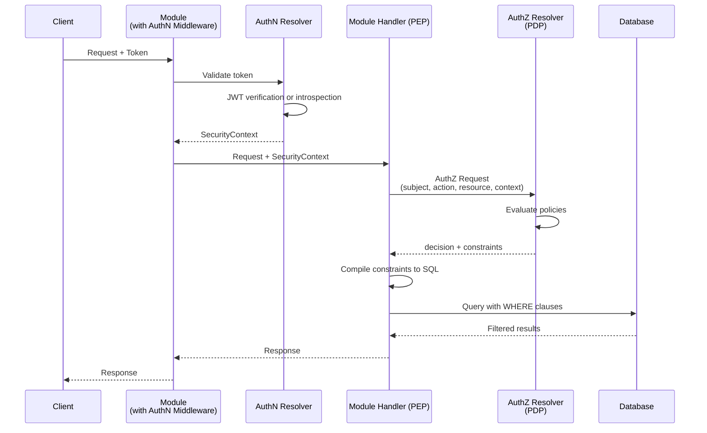
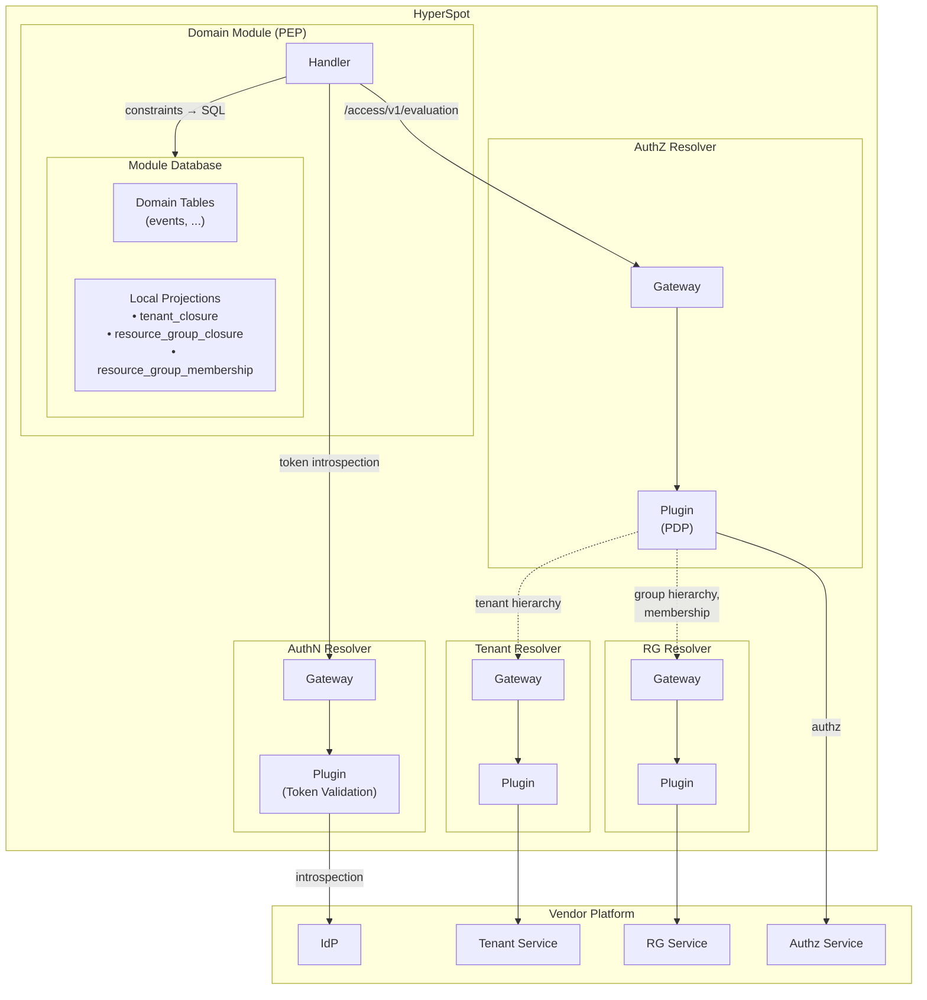
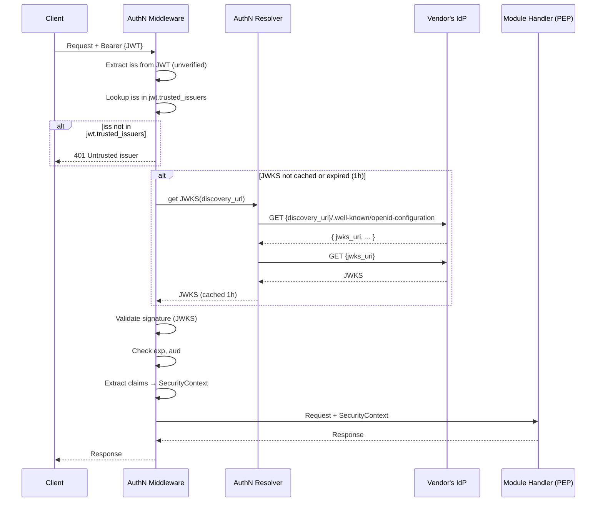
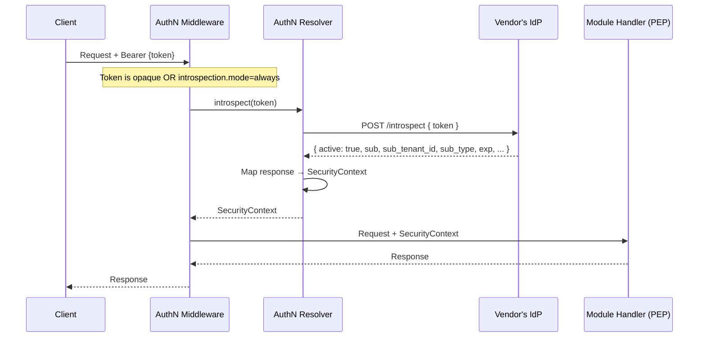
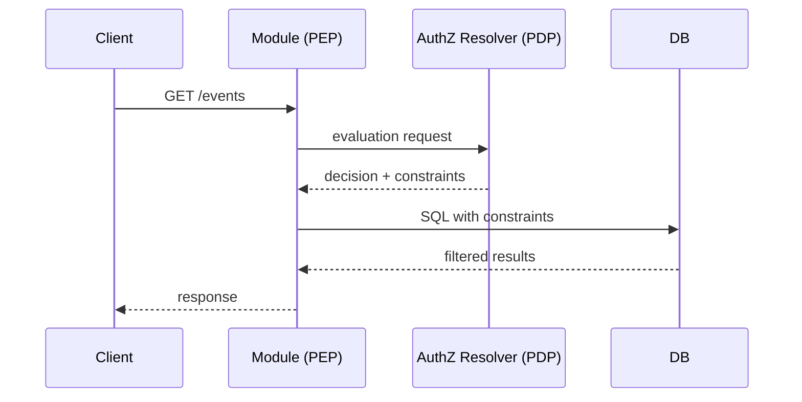

# Authentication & Authorization Design

## Table of Contents

- [Authentication \& Authorization Design](#authentication--authorization-design)
  - [Table of Contents](#table-of-contents)
  - [Overview](#overview)
    - [PDP/PEP Model](#pdppep-model)
    - [Request Flow](#request-flow)
    - [AuthN Resolver and AuthZ Resolver: Gateway + Plugin Architecture](#authn-resolver-and-authz-resolver-gateway--plugin-architecture)
    - [Integration Architecture](#integration-architecture)
    - [Deployment Modes and Trust Model](#deployment-modes-and-trust-model)
    - [Plugin Roles](#plugin-roles)
  - [Core Terms](#core-terms)
  - [Token Scopes](#token-scopes)
    - [Overview](#overview-1)
    - [Scope vs Permission](#scope-vs-permission)
    - [First-party vs Third-party Apps](#first-party-vs-third-party-apps)
    - [Vendor Neutrality](#vendor-neutrality)
    - [SecurityContext Integration](#securitycontext-integration)
    - [PDP Evaluation Flow](#pdp-evaluation-flow)
    - [Gateway Scope Enforcement (Optional)](#gateway-scope-enforcement-optional)
- [Authentication](#authentication)
  - [Overview](#overview-2)
    - [Token Validation Modes](#token-validation-modes)
    - [JWT Local Validation](#jwt-local-validation)
    - [Token Introspection](#token-introspection)
    - [AuthN Result: Security Context](#authn-result-security-context)
  - [Configuration](#configuration)
    - [JWT Settings](#jwt-settings)
    - [JWKS Settings](#jwks-settings)
    - [Introspection Settings](#introspection-settings)
  - [Token Introspection](#token-introspection-1)
  - [OpenID Connect Integration](#openid-connect-integration)
    - [Issuer Configuration](#issuer-configuration)
    - [Discovery](#discovery)
  - [Validation](#validation)
    - [Token Expiration](#token-expiration)
    - [Audience Validation](#audience-validation)
  - [Introspection Caching](#introspection-caching)
- [Authorization](#authorization)
  - [Why AuthZEN (and Why It's Not Enough)](#why-authzen-and-why-its-not-enough)
    - [Why Access Evaluation API Alone Isn't Enough](#why-access-evaluation-api-alone-isnt-enough)
      - [LIST Operations](#list-operations)
      - [Point Operations (GET/UPDATE/DELETE)](#point-operations-getupdatedelete)
    - [Why Search API Doesn't Work](#why-search-api-doesnt-work)
    - [Our Solution: Extended Evaluation Response](#our-solution-extended-evaluation-response)
  - [PEP Enforcement](#pep-enforcement)
    - [Unified PEP Flow](#unified-pep-flow)
    - [Constraint Compilation to SQL](#constraint-compilation-to-sql)
    - [Fail-Closed Rules](#fail-closed-rules)
  - [Authorization Decision Caching](#authorization-decision-caching)
    - [Critical Security Requirements](#critical-security-requirements)
    - [Open Questions (TODO)](#open-questions-todo)
  - [API Specifications](#api-specifications)
    - [Access Evaluation API (AuthZEN-extended)](#access-evaluation-api-authzen-extended)
      - [Design Principles](#design-principles)
      - [Request](#request)
      - [Bearer Token in Context](#bearer-token-in-context)
      - [Response](#response)
      - [PEP Decision Matrix](#pep-decision-matrix)
      - [Operation-Specific Behavior](#operation-specific-behavior)
      - [Response with Resource Group Predicate](#response-with-resource-group-predicate)
      - [Deny Response](#deny-response)
  - [Predicate Types Reference](#predicate-types-reference)
    - [1. Equality Predicate (`type: "eq"`)](#1-equality-predicate-type-eq)
    - [2. IN Predicate (`type: "in"`)](#2-in-predicate-type-in)
    - [3. Tenant Subtree Predicate (`type: "in_tenant_subtree"`)](#3-tenant-subtree-predicate-type-in_tenant_subtree)
    - [4. Group Membership Predicate (`type: "in_group"`)](#4-group-membership-predicate-type-in_group)
    - [5. Group Subtree Predicate (`type: "in_group_subtree"`)](#5-group-subtree-predicate-type-in_group_subtree)
    - [Group Tenant Scoping](#group-tenant-scoping)
  - [PEP Property Mapping](#pep-property-mapping)
  - [Capabilities -\> Predicate Matrix](#capabilities---predicate-matrix)
    - [`require_constraints` Flag](#require_constraints-flag)
    - [Capabilities Array](#capabilities-array)
  - [Table Schemas (Local Projections)](#table-schemas-local-projections)
    - [`tenant_closure`](#tenant_closure)
    - [`resource_group_closure`](#resource_group_closure)
    - [`resource_group_membership`](#resource_group_membership)
  - [Usage Scenarios](#usage-scenarios)
- [Open Questions](#open-questions)
- [References](#references)
  - [Authentication](#authentication-1)
  - [Authorization](#authorization-1)
  - [Internal](#internal)

---

## Overview

This document describes HyperSpot's approach to authentication (AuthN) and authorization (AuthZ).

**Authentication** verifies the identity of the subject making a request. HyperSpot uses the **AuthN Resolver** module to integrate with vendor's Identity Provider (IdP), validate access tokens, and extract subject identity into a `SecurityContext`.

**Authorization** determines what the authenticated subject can do. HyperSpot uses the **AuthZ Resolver** module (acting as PDP) to obtain access decisions and query-level constraints. The core challenge: HyperSpot modules need to enforce authorization at the **query level** (SQL WHERE clauses), not just perform point-in-time access checks. See [ADR 0001](../adrs/authorization/0001-pdp-pep-authorization-model.md) for the authorization model and [ADR 0002](../adrs/authorization/0002-split-authn-authz-resolvers.md) for the rationale behind separating AuthN and AuthZ.

**AuthN Middleware:**

Authentication is performed by **AuthN middleware** within the module that accepts the request. The middleware:
1. Extracts the bearer token from the request
2. Calls AuthN Resolver (Gateway) for validation (JWT local or introspection)
3. Receives `SecurityContext` containing validated subject identity
4. Passes the `SecurityContext` to the module's handler (PEP)

This pattern applies to any module accepting external requests: API Gateway module, Domain Module (if exposed directly), gRPC Gateway module, etc. The authorization model is entry-point agnostic.

### PDP/PEP Model

This document uses the PDP/PEP authorization model (per NIST SP 800-162):

- **PDP (Policy Decision Point)** — evaluates policies and returns access decisions with constraints
- **PEP (Policy Enforcement Point)** — enforces PDP decisions at resource access points

In HyperSpot's architecture:
- **AuthZ Resolver** (via vendor-specific plugin) serves as the **PDP**
- **Domain modules** act as **PEPs**, applying constraints to database queries
- **AuthN Resolver** validates tokens and produces SecurityContext (separate concern from PDP)

See [ADR 0001](../adrs/authorization/0001-pdp-pep-authorization-model.md) for the full rationale.

### Request Flow



**Separation of concerns:**
1. **AuthN Middleware** — calls AuthN Resolver to validate token, produces `SecurityContext`
2. **Module Handler (PEP)** — receives SecurityContext, builds AuthZ request, compiles constraints to SQL
3. **AuthZ Resolver (PDP)** — evaluates policies, returns decision + constraints

### AuthN Resolver and AuthZ Resolver: Gateway + Plugin Architecture

Since IdP and PDP are vendor-specific, HyperSpot cannot implement authentication and authorization directly. Instead, we use the **gateway + plugin** pattern with two separate resolvers:

- **AuthN Resolver** — a HyperSpot gateway module that defines a unified interface for authentication operations (token validation, introspection, SecurityContext production)
- **AuthZ Resolver** — a HyperSpot gateway module that defines a unified interface for authorization operations (PDP functionality, policy evaluation, constraint generation)
- **Vendor Plugins** — implement the AuthN and/or AuthZ interfaces, integrating with vendor's IdP and Authorization API

This separation provides:
- **Separation of concerns** — OIDC/JWT standards (AuthN) vs AuthZEN standards (AuthZ)
- **Deployment flexibility** — AuthN on edge, AuthZ centralized in distributed scenarios
- **Security boundaries** — Credentials (tokens) isolated in AuthN layer, AuthZ works with validated identity
- **Mix & match vendors** — Use different vendors for IdP (AuthN) and Policy Engine (AuthZ)

Each vendor develops their own AuthN and AuthZ plugins (or a unified plugin implementing both interfaces) that bridge to their specific systems. See [ADR 0002](../adrs/authorization/0002-split-authn-authz-resolvers.md) for the rationale behind this separation.

### Integration Architecture



**Communication flow:**
1. **AuthN Middleware → AuthN Resolver (Gateway)** — Module's middleware calls for token validation and SecurityContext extraction
2. **AuthN Resolver (Gateway) → AuthN Resolver (Plugin)** — gateway delegates to vendor plugin
3. **AuthN Resolver (Plugin) → IdP** — token introspection (for opaque tokens or JWT enrichment)
4. **Handler → AuthZ Resolver (Gateway)** — PEP calls for authorization decisions with SecurityContext
5. **AuthZ Resolver (Gateway) → AuthZ Resolver (Plugin)** — gateway delegates to vendor plugin (PDP)
6. **AuthZ Resolver (Plugin) → Authz Svc** — policy evaluation
7. **AuthZ Resolver (Plugin) → Tenant Resolver (Gateway)** — tenant hierarchy queries
8. **AuthZ Resolver (Plugin) → RG Resolver (Gateway)** — group hierarchy and membership queries
9. **Tenant/RG Resolver (Gateway) → Plugin → Vendor Service** — gateway delegates to plugin, plugin syncs from vendor

### Deployment Modes and Trust Model

Both AuthN Resolver and AuthZ Resolver can run in two deployment configurations:

**In-Process (Plugin):**
- Resolvers run as plugins in the same process
- Communication via direct function calls
- Trust model: implicit — same process, same memory space
- No additional authentication required

**Out-of-Process (Separate Service):**
- Resolvers run as separate processes (same machine or remote)
- Communication via gRPC
- Trust model: explicit authentication required
- **mTLS required** — Resolver authenticates that the caller is legitimate

**Trust Boundaries:**

In both modes, AuthZ Resolver (PDP) trusts subject identity data from PEP. The mTLS in out-of-process mode authenticates *which service* is calling, not the validity of subject claims. Subject identity originates from AuthN Resolver (Gateway) and flows through PEP to AuthZ Resolver.

| Aspect | In-Process | Out-of-Process |
|--------|------------|----------------|
| Gateway → Resolver | implicit | mTLS |
| Subject identity trust | Same process | Authenticated caller |
| Network exposure | none | internal network only |

### Plugin Roles

**AuthN Plugin:**

The AuthN Resolver plugin bridges HyperSpot to the vendor's IdP. The plugin is responsible for:
- **IdP communication** — calling introspection endpoints, handling IdP-specific protocols
- **Claim enrichment** — if the IdP doesn't include `subject_type` or `subject_tenant_id` in tokens, the plugin fetches this information from vendor services
- **Response mapping** — converting IdP-specific responses to `SecurityContext`
- **Token scope extraction** — detecting first-party vs third-party apps and setting `token_scopes` accordingly

**AuthZ Plugin:**

The AuthZ Resolver plugin bridges HyperSpot to the vendor's Authorization Service (PDP). The plugin is responsible for:
- **Policy evaluation** — calling vendor's authorization API with subject, action, resource, context
- **Constraint generation** — translating vendor's policy decisions into SQL-compilable constraints
- **Hierarchy queries** — using Tenant Resolver and RG Resolver to query tenant and group hierarchies for constraint generation
- **Token validation** (optional) — in out-of-process deployments, independently validating bearer_token for defense-in-depth

**Unified Plugin Pattern:**

Vendors with integrated AuthN+AuthZ APIs can provide a unified plugin implementing both interfaces, allowing single API calls to vendor services, shared caching between AuthN and AuthZ operations, and coordinated version updates. See [ADR 0002](../adrs/authorization/0002-split-authn-authz-resolvers.md) for details.

---

## Core Terms

- **Access Token** - Credential presented by the client to authenticate requests. Format is not restricted — can be opaque token (validated via introspection) or self-contained JWT. The key requirement: it must enable authentication and subject identification.
- **Subject / Principal** - Actor initiating the request (user or API client), identified via access token
- **Tenant** - Domain of ownership/responsibility and policy (billing, security, data isolation). See [TENANT_MODEL.md](./TENANT_MODEL.md)
- **Subject Owner Tenant** - Tenant the subject belongs to (owning tenant of the subject)
- **Context Tenant** - Tenant scope root for the operation (may differ from subject owner tenant in cross-tenant scenarios)
- **Resource Owner Tenant** - Actual tenant owning the resource (`owner_tenant_id`)
- **Resource** - Object with owner tenant identifier
- **Resource Group** - Optional container for resources, used for access control. See [RESOURCE_GROUP_MODEL.md](./RESOURCE_GROUP_MODEL.md)
- **Permission** - `{ resource_type, action }` - allowed operation identifier
- **Access Constraints** - Structured predicates returned by the PDP for query-time enforcement. NOT policies (which are stored vendor-side), but compiled, time-bound enforcement artifacts.

  **Why "constraints" not "grants":** The term "grant" is overloaded in authorization contexts—OAuth uses it for token acquisition flows (Authorization Code Grant), Zanzibar/ReBAC uses it for static relation tuples stored in the system. Constraints are fundamentally different: they are *computed predicates* returned by PDP at evaluation time, not stored permission facts. The term "constraints" accurately describes their role as query-level restrictions.
- **Security Context** - Result of successful authentication containing subject identity, tenant information, and optionally the original bearer token. Flows from authentication to authorization. Contains: `subject_id`, `subject_type`, `subject_tenant_id`, `token_scopes`, `bearer_token`.
- **Token Scopes** - Capability restrictions extracted from the access token. Act as a "ceiling" on what an application can do, regardless of user's actual permissions. See [Token Scopes](#token-scopes).

---

## Token Scopes

### Overview

Token scopes provide capability narrowing for third-party applications. They act as a "ceiling" on what an application can do, regardless of user's actual permissions.

**Key principle:** `effective_access = min(token_scopes, user_permissions)`

### Scope vs Permission

| Aspect | Scope | Permission |
|--------|-------|------------|
| Granularity | Coarse (human-readable) | Fine (technical) |
| Example | `read:calendar` | `gts.x.events.event.v1~:read` |
| Who defines | OAuth consent / IdP | PDP policies |
| Purpose | Limit app capabilities | Grant user access |

### First-party vs Third-party Apps

| App Type | Example | token_scopes | Behavior |
|----------|---------|--------------|----------|
| First-party | UI, CLI | `["*"]` | No restrictions, full user permissions |
| Third-party | Partner integrations | `["read:events"]` | Limited to granted scopes |

**Detection:** AuthN Resolver plugin determines app type during introspection and sets `token_scopes` accordingly. HyperSpot does not maintain a trusted client list.

### Vendor Neutrality

HyperSpot accepts scopes as opaque strings (`Vec<String>`). Different vendors use
different formats:
- Google-style: `https://api.vendor.com/auth/tasks.read`
- Simple strings: `read_all`, `admin`
- No scopes: Some vendors encode everything in roles

AuthN Resolver plugin is responsible for:
1. Extracting scopes from token (JWT claim or introspection response)
2. Mapping vendor format to internal representation
3. Setting `["*"]` for first-party apps

### SecurityContext Integration

```rust
SecurityContext {
    subject_id: "user-123",
    subject_type: "gts.x.core.security.subject.user.v1~",
    subject_tenant_id: "tenant-456",
    bearer_token: "eyJ...",
    token_scopes: ["*"],  // first-party: full access
    // OR
    token_scopes: ["read:events", "write:tasks"],  // third-party: limited
}
```

### PDP Evaluation Flow

1. **PEP** includes `token_scopes` in evaluation request context
2. **PDP** applies scope restrictions:
   - If `token_scopes: ["*"]` → no scope-based restrictions
   - Otherwise → intersect with user permissions
3. **PDP** returns constraints reflecting both scopes and permissions

### Gateway Scope Enforcement (Optional)

For performance-critical paths, API Gateway can reject requests early based on
scope mismatch without calling PDP.

**Configuration:**
```yaml
auth:
  gateway_scope_checks:
    enabled: true
    routes:
      "/admin/*":
        required_scopes: ["admin"]
      "/events/v1/*":
        required_scopes: ["read:events", "write:events"]  # any of these
```

**Behavior:**
- If `token_scopes: ["*"]` → always pass
- If `token_scopes` contains any of `required_scopes` → pass
- Otherwise → 403 Forbidden (before PDP call)

**Note:** This is coarse-grained optimization. Fine-grained permission checks still happen in PDP.

---

# Authentication

## Overview

HyperSpot integrates with the vendor's Identity Provider (IdP) to authenticate requests. It supports two token formats:

- **JWT (JSON Web Token)** — Self-contained tokens (RFC 7519), can be validated locally via signature verification or via introspection for revocation checking and claim enrichment
- **Opaque tokens** — Tokens validated via Token Introspection endpoint (RFC 7662)

For JWT-based authentication, HyperSpot follows OpenID Connect Core 1.0 standards. Auto-configuration is supported via OpenID Connect Discovery 1.0 (`.well-known/openid-configuration`).

**Token type detection**: JWT tokens are identified by their structure (three base64url-encoded segments separated by dots). All other tokens are treated as opaque.

### Token Validation Modes

| Mode | When | How |
|------|------|-----|
| JWT local | JWT + introspection not required | Validate signature via JWKS, extract claims |
| Introspection | Opaque token OR JWT requiring enrichment/revocation check | Plugin calls `introspection_endpoint` |

### JWT Local Validation



### Token Introspection



### AuthN Result: Security Context

Successful authentication produces a `SecurityContext` that flows to authorization:

```rust
SecurityContext {
    subject_id: String,           // from `sub` claim
    subject_type: GtsTypeId,      // vendor-specific subject type (optional)
    subject_tenant_id: TenantId,  // Subject Owner Tenant - tenant the subject belongs to
    token_scopes: Vec<String>,    // capability restrictions from token (["*"] for first-party)
    bearer_token: Option<String>, // original token for forwarding and PDP validation
}
```

**Field sources by validation mode:**

| Field | JWT Local | Introspection |
|-------|-----------|---------------|
| `subject_id` | `sub` claim | Introspection response `sub` |
| `subject_type` | Custom claim (vendor-defined) | Plugin maps from response |
| `subject_tenant_id` | Custom claim (vendor-defined) | Plugin maps from response |
| `token_scopes` | `scope` claim (space-separated) or plugin detection | Plugin maps from response or detects first-party |
| `bearer_token` | Original token from `Authorization` header | Original token from `Authorization` header |

**Notes:**
- Token expiration (`exp`) is validated during authentication but not included in SecurityContext. Expiration is token metadata, not identity. The caching layer uses `exp` as upper bound for cache entry TTL.
- **Security:** `bearer_token` is a credential. It MUST NOT be logged, serialized to persistent storage, or included in error messages. Implementations should use opaque wrapper types (e.g., `Secret<String>`) and exclude from `Debug` output. The token is included for two purposes:
  1. **Forwarding** — AuthZ Resolver plugin may need to call external vendor services that require the original bearer token for authentication
  2. **PDP validation** — In out-of-process deployments, AuthZ Resolver (PDP) may independently validate the token as defence-in-depth, not trusting the PEP's claim extraction

---

## Configuration

```yaml
auth:
  jwt:
    trusted_issuers:
      "https://accounts.google.com":
        discovery_url: "https://accounts.google.com"
      "my-corp-idp":
        discovery_url: "https://idp.corp.example.com"
    require_audience: true
    expected_audience:
      - "https://*.my-company.com"
      - "https://api.my-company.com"
  jwks:
    cache:
      ttl: 1h
  introspection:
    mode: opaque_only
    endpoint: "https://idp.corp.example.com/oauth2/introspect"
    cache:
      enabled: true
      max_entries: 10000
      ttl: 5m
    endpoint_discovery_cache:
      enabled: true
      max_entries: 10000
      ttl: 1h
```

### JWT Settings

- `auth.jwt.trusted_issuers` — map of issuer identifier to discovery config
  - **Key** — expected `iss` claim value in JWT
  - **`discovery_url`** — base URL for OpenID Discovery (`{value}/.well-known/openid-configuration`)
- `auth.jwt.require_audience` — whether to require `aud` claim validation (default: `false`)
- `auth.jwt.expected_audience` — list of glob patterns for valid audiences (e.g., `https://*.my-company.com`)

### JWKS Settings

- `auth.jwks.cache.ttl` — JWKS cache TTL (default: `1h`)

### Introspection Settings

- `auth.introspection.mode` — when to introspect: `never`, `opaque_only` (default), `always`
- `auth.introspection.endpoint` — global introspection endpoint URL (applies to all issuers)
- `auth.introspection.cache.enabled` — enable introspection result caching (default: `true`)
- `auth.introspection.cache.max_entries` — max cached introspection results (default: `10000`)
- `auth.introspection.cache.ttl` — introspection result cache TTL (default: `5m`)
- `auth.introspection.endpoint_discovery_cache.enabled` — cache discovered introspection endpoints (default: `true`)
- `auth.introspection.endpoint_discovery_cache.max_entries` — max cached endpoints (default: `10000`)
- `auth.introspection.endpoint_discovery_cache.ttl` — endpoint discovery cache TTL (default: `1h`)

---

## Token Introspection

Introspection (RFC 7662) is used in three scenarios:

1. **Opaque tokens** — token is not self-contained, must be validated by IdP
2. **JWT enrichment** — JWT lacks HyperSpot-specific claims (`sub_tenant_id`, `sub_type`), plugin fetches additional subject info via introspection
3. **Revocation checking** — even for valid JWTs, introspection provides central point to check if token was revoked (e.g., user logout, compromised token)

Configuration determines when introspection is triggered via `introspection.mode`:
- `introspection.mode: always` — all tokens (JWT and opaque) go through introspection
- `introspection.mode: opaque_only` — only opaque tokens (default)
- `introspection.mode: never` — JWT local validation only (no revocation check)

**Configuration Matrix:**

| Token Type | `introspection.mode` | `introspection.endpoint` | Behavior |
|------------|----------------------|--------------------------|----------|
| JWT | `never` | (any) | Local validation only, no introspection |
| JWT | `opaque_only` | (any) | Local validation only |
| JWT | `always` | configured | Use configured endpoint |
| JWT | `always` | not configured | Discover endpoint from issuer's OIDC config |
| Opaque | `never` | (any) | **401 Unauthorized** (cannot validate opaque without introspection) |
| Opaque | `opaque_only` / `always` | configured | Use configured endpoint |
| Opaque | `opaque_only` / `always` | not configured | **401 Unauthorized** (no `iss` claim to discover endpoint) |

**Note:** Discovery requires the `iss` claim to look up the issuer configuration. Opaque tokens don't contain claims, so discovery is only possible for JWTs. For opaque tokens, `introspection.endpoint` must be explicitly configured.

## OpenID Connect Integration

HyperSpot leverages OpenID Connect standards for authentication:

- **JWT validation** per OpenID Connect Core 1.0 — signature verification, claim validation
- **Discovery** via `.well-known/openid-configuration` (OpenID Connect Discovery 1.0) — automatic endpoint configuration
- **JWKS (JSON Web Key Set)** — public keys for JWT signature validation, fetched from `jwks_uri`
- **Token Introspection** (RFC 7662) — for opaque token validation, JWT enrichment, and revocation checking

### Issuer Configuration

The `trusted_issuers` map is required for JWT validation. This separation exists because:

1. **Trust anchor** — HyperSpot must know which issuers to trust before receiving tokens
2. **Flexible mapping** — `iss` claim may differ from discovery URL (e.g., custom identifiers)
3. **Bootstrap problem** — to validate JWT, we need JWKS; to get JWKS, we need discovery URL

**Lazy initialization flow:**
1. Admin configures `jwt.trusted_issuers` map
2. On first request, extract `iss` from JWT (unverified)
3. Look up `iss` in `jwt.trusted_issuers` → get discovery URL
4. If not found → reject (untrusted issuer)
5. Fetch `{discovery_url}/.well-known/openid-configuration`
6. Validate and cache JWKS, then verify JWT signature

### Discovery

Discovery is performed lazily on the first authenticated request (not at startup). HyperSpot fetches the OpenID configuration from `{issuer}/.well-known/openid-configuration` and extracts:

- `jwks_uri` — for fetching signing keys
- `introspection_endpoint` — for opaque token validation (optional)

**Caching:** JWKS is cached for `jwks.cache.ttl` (default: **1 hour**) and refreshed automatically on cache expiry or when signature validation fails with unknown `kid`.

---

## Validation

### Token Expiration

The `exp` (expiration) claim is always validated:
- JWT local: `exp` claim must be in the future
- Introspection: response `active` must be `true` and `exp` must be in the future

### Audience Validation

The `aud` (audience) claim validation is controlled by `jwt.require_audience` and `jwt.expected_audience`:

- If `require_audience: true` and JWT lacks `aud` claim → **401 Unauthorized**
- If `require_audience: false` (default) and JWT lacks `aud` claim → validation passes
- If JWT has `aud` claim and `expected_audience` is configured → at least one audience must match a pattern (glob pattern matching with `*` wildcard)
- If JWT has `aud` claim but `expected_audience` is empty/not configured → validation passes

---

## Introspection Caching

Introspection results MAY be cached to reduce IdP load and latency (`introspection.cache.*`). Trade-off: revoked tokens remain valid until cache expires. Cache TTL should be shorter than token lifetime; use token `exp` as upper bound for cache entry lifetime.

---

# Authorization

## Why AuthZEN (and Why It's Not Enough)

We chose [OpenID AuthZEN Authorization API 1.0](https://openid.net/specs/authorization-api-1_0.html) (approved 2026-01-12) as the foundation for AuthZ Resolver. See [ADR 0001](../adrs/authorization/0001-pdp-pep-authorization-model.md) for the full analysis of considered options.

**Why AuthZEN:**
- Industry standard with growing ecosystem
- Vendor-neutral: doesn't dictate policy model (RBAC/ABAC/ReBAC)
- Clean subject/action/resource/context structure
- Extensible via `context` field

However, AuthZEN out of the box doesn't solve HyperSpot's core requirement: **query-level authorization**.

### Why Access Evaluation API Alone Isn't Enough

AuthZEN's Access Evaluation API answers: "Can subject S perform action A on resource R?" — a point-in-time check returning `decision: true/false`.

#### LIST Operations

For **LIST operations** with Access Evaluation API, we'd need an iterative process:

1. Fetch a batch of resources from DB (e.g., `LIMIT 100` to get candidates for a page of 10)
2. Send batch to PDP for evaluation (AuthZEN supports batching via Access Evaluations API)
3. Filter results based on decisions
4. If filtered result < requested page size → fetch next batch, repeat

**The core problem**: unpredictable number of iterations. If the user has access to only 1% of resources, fetching a page of 10 items might require 10+ round-trips (DB → PDP → filter → not enough → repeat). Worst case: user has access to nothing, and we scan the entire table before returning empty result.

**Additional problems:**
- **Pagination cursor invalidation** — cursor points to DB offset, but after filtering the mapping breaks
- **Total count impossible** — can't know total accessible count without evaluating all resources
- **Inconsistent page sizes** — hard to guarantee exactly N items per page

#### Point Operations (GET/UPDATE/DELETE)

For **point operations**, Access Evaluation API could technically work, but requires an inefficient flow:

1. Query database to fetch the resource
2. Send resource to PDP for evaluation
3. If denied, return 403/404

**The problem**: the subject might not have rights to access this resource type at all. The database query is wasteful — we should fail fast before touching the database.

**What we want instead:**
1. Ask PDP first: "Can subject S perform action A on resource type T?"
2. If denied → 403 immediately (fail-fast, no database query)
3. If allowed → get constraints, execute query with `WHERE id = :id AND (constraints)`
4. If 0 rows → 404 (hides resource existence from unauthorized users)

### Why Search API Doesn't Work

AuthZEN's Resource Search API answers: "What resources can subject S perform action A on?" — returning a list of resource IDs.

This **assumes the PDP has access to resource data**. In HyperSpot's architecture, resources live in the PEP's database — the PDP cannot enumerate what it doesn't have.

This creates an architectural mismatch:
- **PDP** knows "who can access what" (authorization policies)
- **PEP** knows "what exists" (resources in database)

To use Search API, we'd need to sync all resources to the PDP — defeating the purpose of keeping data local.

### Our Solution: Extended Evaluation Response

We extend AuthZEN's evaluation response with optional `context.constraints`. Instead of returning resource IDs (enumeration), the PDP returns **predicates** that the PEP compiles to SQL WHERE clauses:

```jsonc
// PDP response
{
  "decision": true,
  "context": {
    "constraints": [
      {
        "predicates": [
          { "type": "in_tenant_subtree", "resource_property": "owner_tenant_id", "root_tenant_id": "tenant-123", "respect_barrier": true }
        ]
      }
    ]
  }
}
// PEP compiles to: WHERE owner_tenant_id IN (SELECT descendant_id FROM tenant_closure WHERE ancestor_id = 'tenant-123')
// Result: SELECT * FROM events WHERE (constraints) LIMIT 10 — correct pagination!
```

This gives us:
- **O(1) authorization overhead** per query (single PDP call)
- **Correct pagination** — constraints applied at SQL level before LIMIT
- **Accurate counts** — database handles filtering
- **No resource sync** — PDP never needs to know about individual resources

---

## PEP Enforcement

### Unified PEP Flow

All operations (LIST, GET, UPDATE, DELETE) follow the same flow:



The only difference between LIST and point operations (GET/UPDATE/DELETE) is whether `resource.id` is present.

### Constraint Compilation to SQL

When constraints are present, the PEP compiles each constraint to SQL WHERE clauses:

1. **Predicates within a constraint** (`predicates` array) are AND'd together
2. **Multiple constraints** (`constraints` array) are OR'd together
3. **Unknown predicate types** cause that constraint to be treated as false (fail-closed)

### Fail-Closed Rules

The PEP MUST:

1. **Validate decision** - `decision: false` or missing -> deny all (403 Forbidden)
2. **Enforce require_constraints** - If `require_constraints: true` and `decision: true` but no `constraints` -> deny all (403 Forbidden)
3. **Apply constraints when present** - If `constraints` array is present, apply to SQL; if all constraints evaluate to false -> deny all
4. **Trust decision when constraints not required** - `decision: true` without `constraints` AND `require_constraints: false` -> allow (e.g., CREATE operations)
5. **Handle unreachable PDP** - Network failure, timeout -> deny all
6. **Handle unknown predicate types** - Treat containing constraint as false; if all constraints false -> deny all
7. **Handle empty or missing predicates** - If a constraint has empty `predicates: []` or missing `predicates` field -> treat constraint as malformed -> deny all. Constraints MUST have at least one predicate.
8. **Handle missing required fields** - Treat containing constraint as false
9. **Handle unknown property names** - Treat containing constraint as false (PEP doesn't know how to map)

---

## Authorization Decision Caching

PEP implementations MAY cache authorization decisions returned by the PDP to reduce latency and PDP load.

**Status: Requires further design work.** This section outlines high-level considerations. Detailed caching protocol (cache-control metadata, TTL negotiation, invalidation signals) is not yet specified.

### Critical Security Requirements

Any caching implementation MUST satisfy:

1. **Token expiration boundary** - Cached decisions MUST NOT outlive the token's validity period (`exp` claim). Cache TTL must be: `min(pdp_suggested_ttl, token_expires_at - now)`.

2. **Scope isolation** - Token scopes MUST be part of the cache key. A decision cached for a first-party token (broad scope `["*"]`) MUST NOT be reused for a third-party app token (narrow scopes like `["users:read"]`). This prevents privilege escalation via cache.

3. **Tenant isolation** - Cache key MUST include tenant context to prevent cross-tenant data leakage.

### Open Questions (TODO)

- Cache key structure - Which request fields participate? How to canonicalize `resource.properties`?
- Cache-control protocol - Should PDP signal cacheability? TTL negotiation?
- Invalidation strategy - Proactive invalidation (policy version, WebSocket events) vs pure TTL expiration?
- Token expiration access - Add `token_expires_at` to `SecurityContext` or pass separately?
- Stale-while-revalidate - For zero-downtime policy updates?

---

## API Specifications

### Access Evaluation API (AuthZEN-extended)

Two endpoints for authorization checks, following AuthZEN structure:

- `POST /access/v1/evaluation` - Single evaluation request
- `POST /access/v1/evaluations` - Batch evaluation (array of requests -> array of responses)

PDP returns `decision` plus optional `constraints` for each evaluation.

#### Design Principles

1. **AuthZEN alignment** - Use same `subject`, `action`, `resource`, `context` structure
2. **Constraints are optional** - PDP decides when to include based on action type
3. **Constraint-first** - Return predicates, not enumerated IDs
4. **Capability negotiation** - PEP declares enforcement capabilities
5. **Fail-closed** - Unknown constraints or schemas result in deny
6. **OR/AND semantics** - Multiple constraints are OR'd (alternative access paths), predicates within constraint are AND'd
7. **Token passthrough** - Original bearer token optionally included in `context.bearer_token` for PDP validation and external service calls (MUST NOT be logged)

#### Request

```
POST /access/v1/evaluation
Content-Type: application/json
```

```jsonc
{
  // AuthZEN standard fields
  "subject": {
    "type": "gts.x.core.security.subject.user.v1~",
    "id": "a254d252-7129-4240-bae5-847c59008fb6",
    "properties": {
      "tenant_id": "51f18034-3b2f-4bfa-bb99-22113bddee68"
    }
  },
  "action": {
    "name": "list"  // or "read", "update", "delete", "create"
  },
  "resource": {
    "type": "gts.x.events.event.v1~",
    "id": "e81307e5-5ee8-4c0a-8d1f-bd98a65c517e",  // present for point ops, absent for list
    "properties": {
      "topic_id": "gts.x.core.events.topic.v1~z.app._.some_topic.v1"
    }
  },

  // HyperSpot extension: context with tenant and PEP capabilities
  "context": {
    // Tenant context — use ONE of: tenant_id OR tenant_subtree

    // Option 1: Single tenant (simple case)
    // "tenant_id": "51f18034-3b2f-4bfa-bb99-22113bddee68",

    // Option 2: Tenant subtree (with hierarchy options)
    "tenant_subtree": {
      "root_id": "51f18034-3b2f-4bfa-bb99-22113bddee68",
      "include_root": true,        // default: true
      "respect_barrier": true,     // default: false, honor self_managed barrier
      "tenant_status": ["active", "suspended"]  // optional, filter by status
    },

    // Token scopes from SecurityContext — capability restrictions for third-party apps
    "token_scopes": ["read:events", "write:tasks"],  // or ["*"] for first-party

    // PEP enforcement mode
    "require_constraints": true,  // if true, decision without constraints = deny

    // PEP capabilities: what predicate types the caller can enforce locally
    "capabilities": ["tenant_hierarchy", "group_membership", "group_hierarchy"],

    // Original bearer token (optional) — see "Bearer Token in Context" below
    "bearer_token": "eyJhbGciOiJSUzI1NiIs..."
  }
}
```

#### Bearer Token in Context

The `context.bearer_token` field is optional. PEP includes it when AuthZ Resolver (PDP) needs access to the original token. Use cases:

1. **PDP validation (defence-in-depth)** — In out-of-process deployments, AuthZ Resolver may not fully trust subject claims extracted by AuthN Resolver. AuthZ Resolver can independently validate the token signature and extract claims to verify `subject.id` and `subject.properties` match the token.

2. **External service calls** — AuthZ Resolver plugin may need to call vendor's external APIs (authorization service, user info endpoint, etc.) that require the original bearer token for authentication.

3. **Token-embedded policies** — Some IdPs embed access policies directly in the token (e.g., `permissions`, `roles`, `scopes` claims in JWT). AuthZ Resolver extracts and evaluates these claims to generate constraints.

4. **Scope narrowing** — Token may contain scope restrictions (e.g., `scope: "read:events"`, resource-specific access tokens). AuthZ Resolver uses these to narrow the access decision beyond what static policies would allow.

5. **Audit and tracing** — Token may contain correlation IDs, session info, or other metadata useful for audit logging in AuthZ Resolver.

**When to omit:** If PDP fully trusts PEP's claim extraction and doesn't need to call external services, `bearer_token` can be omitted to reduce payload size and minimize credential exposure.

**Security:** `bearer_token` is a credential. PDP MUST NOT log it, persist it, or include it in error responses.

#### Response

The response contains a `decision` and, when `decision: true`, optional `context.constraints`. Each constraint is an object with a `predicates` array that the PEP compiles to SQL.

```jsonc
{
  "decision": true,
  "context": {
    // Multiple constraints are OR'd together (alternative access paths)
    // Each constraint's predicates are AND'd together
    "constraints": [
      {
        "predicates": [
          {
            // Tenant subtree predicate - uses local tenant_closure table
            "type": "in_tenant_subtree",
            "resource_property": "owner_tenant_id",
            "root_tenant_id": "51f18034-3b2f-4bfa-bb99-22113bddee68",
            "respect_barrier": true,
            "tenant_status": ["active", "suspended"]
          },
          {
            // Equality predicate
            "type": "eq",
            "resource_property": "topic_id",
            "value": "gts.x.core.events.topic.v1~z.app._.some_topic.v1"
          }
        ]
      }
    ]
  }
}
```

#### PEP Decision Matrix

| `decision` | `constraints` | `require_constraints` | PEP Action |
|------------|---------------|----------------------|------------|
| `false` | (any) | (any) | **403 Forbidden** |
| `true` | absent | `false` | Allow (trust PDP decision) |
| `true` | absent | `true` | **403 Forbidden** (constraints required but missing) |
| `true` | present | (any) | Apply constraints to SQL |

**Key insight:** PEP declares via `require_constraints` capability whether it needs constraints for the operation. For LIST operations, this should typically be `true`; for CREATE, it can be `false`.

#### Operation-Specific Behavior

**CREATE** (no constraints needed):
```jsonc
// PEP -> PDP
{
  "action": { "name": "create" },
  "resource": {
    "type": "gts.x.events.event.v1~",
    "properties": { "owner_tenant_id": "tenant-B", "topic_id": "..." }
  }
  // ... subject, context
}

// PDP -> PEP
{ "decision": true }  // no constraints - PEP trusts decision

// PEP: INSERT INTO events ...
```

**LIST** (constraints required):
```jsonc
// PEP -> PDP
{
  "action": { "name": "list" },
  "resource": { "type": "gts.x.events.event.v1~" }  // no id
  // ... subject, context
}

// PDP -> PEP
{
  "decision": true,
  "context": {
    "constraints": [
      {
        "predicates": [
          { "type": "in_tenant_subtree", "resource_property": "owner_tenant_id", "root_tenant_id": "tenant-A", "respect_barrier": true }
        ]
      }
    ]
  }
}

// PEP: SELECT * FROM events WHERE (constraints)
```

**GET/UPDATE/DELETE** (constraints for SQL-level enforcement):
```jsonc
// PEP -> PDP
{
  "action": { "name": "read" },
  "resource": { "type": "gts.x.events.event.v1~", "id": "evt-123" }
  // ... subject, context
}

// PDP -> PEP
{
  "decision": true,
  "context": {
    "constraints": [
      {
        "predicates": [
          { "type": "in_tenant_subtree", "resource_property": "owner_tenant_id", "root_tenant_id": "tenant-A", "respect_barrier": true }
        ]
      }
    ]
  }
}

// PEP: SELECT * FROM events WHERE id = :id AND (constraints)
// 0 rows -> 404 (hides resource existence)
```

#### Response with Resource Group Predicate

```jsonc
{
  "decision": true,
  "context": {
    "constraints": [
      {
        "predicates": [
          {
            // Tenant subtree predicate
            "type": "in_tenant_subtree",
            "resource_property": "owner_tenant_id",
            "root_tenant_id": "tenant-A",
            "respect_barrier": true
          },
          {
            // Group subtree predicate - uses resource_group_membership + resource_group_closure tables
            "type": "in_group_subtree",
            "resource_property": "id",
            "root_group_id": "project-root-group"
          }
        ]
      }
    ]
  }
}
```

#### Deny Response

```jsonc
{
  "decision": false
}
```

---

## Predicate Types Reference

All predicates filter resources based on their properties. The `resource_property` field specifies which property to filter on — these correspond directly to `resource.properties` in the request.

| Type | Description | Required Fields | Optional Fields |
|------|-------------|-----------------|-----------------|
| `eq` | Property equals value | `resource_property`, `value` | — |
| `in` | Property in value list | `resource_property`, `values` | — |
| `in_tenant_subtree` | Tenant subtree via closure table | `resource_property`, `root_tenant_id` | `respect_barrier`, `tenant_status` |
| `in_group` | Flat group membership | `resource_property`, `group_ids` | — |
| `in_group_subtree` | Group subtree via closure table | `resource_property`, `root_group_id` | — |

### 1. Equality Predicate (`type: "eq"`)

Compares resource property to a single value.

**Schema:**
- `type` (required): `"eq"`
- `resource_property` (required): Property name (e.g., `topic_id`, `owner_tenant_id`)
- `value` (required): Single value to compare

```jsonc
{ "type": "eq", "resource_property": "topic_id", "value": "uuid-123" }
// SQL: topic_id = 'uuid-123'
```

### 2. IN Predicate (`type: "in"`)

Compares resource property to a list of values.

**Schema:**
- `type` (required): `"in"`
- `resource_property` (required): Property name (e.g., `owner_tenant_id`, `status`)
- `values` (required): Array of values

```jsonc
{ "type": "in", "resource_property": "owner_tenant_id", "values": ["tenant-1", "tenant-2"] }
// SQL: owner_tenant_id IN ('tenant-1', 'tenant-2')

{ "type": "in", "resource_property": "status", "values": ["active", "pending"] }
// SQL: status IN ('active', 'pending')
```

### 3. Tenant Subtree Predicate (`type: "in_tenant_subtree"`)

Filters resources by tenant subtree using the closure table. The `resource_property` specifies which property contains the tenant ID.

**Schema:**
- `type` (required): `"in_tenant_subtree"`
- `resource_property` (required): Property containing tenant ID (e.g., `owner_tenant_id`)
- `root_tenant_id` (required): Root of tenant subtree
- `respect_barrier` (optional): Honor `self_managed` barrier in hierarchy traversal, default `false`
- `tenant_status` (optional): Filter by tenant status

```jsonc
{
  "type": "in_tenant_subtree",
  "resource_property": "owner_tenant_id",
  "root_tenant_id": "tenant-A",
  "respect_barrier": true,
  "tenant_status": ["active", "suspended"]
}
// SQL: owner_tenant_id IN (
//   SELECT descendant_id FROM tenant_closure
//   WHERE ancestor_id = 'tenant-A'
//     AND (barrier_ancestor_id IS NULL OR barrier_ancestor_id = 'tenant-A')
//     AND descendant_status IN ('active', 'suspended')
// )
```

### 4. Group Membership Predicate (`type: "in_group"`)

Filters resources by explicit group membership. The `resource_property` specifies which property is used for group membership join.

**Schema:**
- `type` (required): `"in_group"`
- `resource_property` (required): Property for group membership join (typically `id`)
- `group_ids` (required): Array of group IDs

```jsonc
{ "type": "in_group", "resource_property": "id", "group_ids": ["group-1", "group-2"] }
// SQL: id IN (
//   SELECT resource_id FROM resource_group_membership
//   WHERE group_id IN ('group-1', 'group-2')
// )
```

### 5. Group Subtree Predicate (`type: "in_group_subtree"`)

Filters resources by group subtree using the closure table. The `resource_property` specifies which property is used for group membership join.

**Schema:**
- `type` (required): `"in_group_subtree"`
- `resource_property` (required): Property for group membership join (typically `id`)
- `root_group_id` (required): Root of group subtree

```jsonc
{ "type": "in_group_subtree", "resource_property": "id", "root_group_id": "root-group" }
// SQL: id IN (
//   SELECT resource_id FROM resource_group_membership
//   WHERE group_id IN (
//     SELECT descendant_id FROM resource_group_closure
//     WHERE ancestor_id = 'root-group'
//   )
// )
```

### Group Tenant Scoping

Resource groups are tenant-scoped. **PDP guarantees** that any `group_ids` (in `in_group` predicate) or `root_group_id` (in `in_group_subtree` predicate) returned in constraints belong to the same tenant as the request context.

**Trust model:**
- PEP trusts this guarantee and does not perform additional tenant validation on group IDs
- PEP does not have access to group metadata (including `tenant_id`) — only `resource_group_membership` and `resource_group_closure` tables
- AuthZ Resolver (PDP via plugin) has access to group hierarchy from vendor's Resource Group service and validates tenant ownership

**Defense in depth:** All group-based constraints also include a tenant predicate on the **resource** (typically `eq` on `owner_tenant_id`). This ensures:
1. PDP validates group belongs to correct tenant (group-level check)
2. SQL filters resources by tenant (resource-level check)

See [RESOURCE_GROUP_MODEL.md](./RESOURCE_GROUP_MODEL.md) for group data model details.

---

## PEP Property Mapping

The `resource_property` in predicates corresponds to `resource.properties` in the request. Each module (PEP) defines a mapping from property names to physical SQL columns. PDP uses property names — **it doesn't know the database schema**.

**Example mapping for Event Manager:**

| Resource Property | SQL Column |
|-------------------|------------|
| `owner_tenant_id` | `events.tenant_id` |
| `topic_id` | `events.topic_id` |
| `id` | `events.id` |

**How PEP compiles predicates to SQL:**

| Predicate | SQL |
|-----------|-----|
| `{ "type": "eq", "resource_property": "topic_id", "value": "v" }` | `events.topic_id = 'v'` |
| `{ "type": "in", "resource_property": "owner_tenant_id", "values": ["t1", "t2"] }` | `events.tenant_id IN ('t1', 't2')` |
| `{ "type": "in_tenant_subtree", "resource_property": "owner_tenant_id", ... }` | `events.tenant_id IN (SELECT descendant_id FROM tenant_closure WHERE ...)` |
| `{ "type": "in_group", "resource_property": "id", "group_ids": ["g1", "g2"] }` | `events.id IN (SELECT resource_id FROM resource_group_membership WHERE ...)` |
| `{ "type": "in_group_subtree", "resource_property": "id", "root_group_id": "g1" }` | `events.id IN (SELECT ... FROM resource_group_membership WHERE group_id IN (SELECT ... FROM resource_group_closure ...))` |

**Conventions:**
- All IDs are UUIDs
- PDP may return GTS IDs (e.g., `gts.x.core.events.topic.v1~...`), PEP converts to UUIDv5

---

## Capabilities -> Predicate Matrix

The PEP declares its capabilities in the request. This determines what predicate types the PDP can return.

### `require_constraints` Flag

The `require_constraints` field (separate from capabilities array) controls PEP behavior when constraints are absent:

| `require_constraints` | `decision: true` without `constraints` |
|-----------------------|----------------------------------------|
| `true` | **deny** (constraints required but missing) |
| `false` | **allow** (trust PDP decision) |

**Usage:**
- For LIST operations: typically `true` (constraints needed for SQL WHERE)
- For CREATE operations: typically `false` (no query, just permission check)
- For GET/UPDATE/DELETE: depends on whether PEP wants SQL-level enforcement or trusts PDP decision

### Capabilities Array

Capabilities declare what predicate types the PEP can enforce locally:

| Capability | Enables Predicate Types |
|------------|---------------------|
| `tenant_hierarchy` | `in_tenant_subtree` |
| `group_membership` | `in_group` |
| `group_hierarchy` | `in_group_subtree` (implies `group_membership`) |

**Capability dependencies:**
- `group_hierarchy` implies `group_membership` — if PEP has the closure table, it necessarily has the membership table
- When declaring capabilities, `["group_hierarchy"]` is sufficient; `group_membership` is implied

**Predicate type availability by capability:**

| Predicate Type | Required Capability |
|-------------|---------------------|
| `eq`, `in` | (none — always available) |
| `in_tenant_subtree` | `tenant_hierarchy` |
| `in_group` | `group_membership` |
| `in_group_subtree` | `group_hierarchy` |

**Capability degradation**: If a PEP lacks a capability, the PDP must either:
1. Expand the predicate to explicit IDs (may be large)
2. Return `decision: false` if expansion is not feasible

---

## Table Schemas (Local Projections)

These tables are maintained locally by HyperSpot gateway modules (Tenant Resolver, Resource Group Resolver) and used by PEPs to execute constraint queries efficiently without calling back to the vendor platform.

### `tenant_closure`

Denormalized closure table for tenant hierarchy. Enables efficient subtree queries without recursive CTEs.

| Column | Type | Nullable | Description |
|--------|------|----------|-------------|
| `ancestor_id` | UUID | No | Parent tenant in the hierarchy |
| `descendant_id` | UUID | No | Child tenant (the one we check ownership against) |
| `barrier_ancestor_id` | UUID | Yes | ID of tenant with `self_managed=true` between ancestor and descendant (NULL if no barrier) |
| `descendant_status` | TEXT | No | Status of descendant tenant (`active`, `suspended`, `deleted`) |

**Notes:**
- Status is denormalized into closure for query simplicity (avoids JOIN). When a tenant's status changes, all rows where it is `descendant_id` are updated.
- The `barrier_ancestor_id` column enables `respect_barrier` filtering: when set, only include descendants where `barrier_ancestor_id IS NULL OR barrier_ancestor_id = :root_tenant_id`.
- Self-referential rows exist: each tenant has a row where `ancestor_id = descendant_id`.
- **Predicate mapping:** `in_tenant_subtree` predicate compiles to SQL using this closure table.

**Example query (in_tenant_subtree):**
```sql
SELECT * FROM events
WHERE owner_tenant_id IN (
  SELECT descendant_id FROM tenant_closure
  WHERE ancestor_id = :root_tenant_id
    AND (barrier_ancestor_id IS NULL OR barrier_ancestor_id = :root_tenant_id)  -- respect_barrier
    AND descendant_status IN ('active', 'suspended')  -- tenant_status filter
)
```

### `resource_group_closure`

Closure table for resource group hierarchy. Similar structure to tenant_closure but simpler (no barrier or status).

| Column | Type | Nullable | Description |
|--------|------|----------|-------------|
| `ancestor_id` | UUID | No | Parent group |
| `descendant_id` | UUID | No | Child group |

**Notes:**
- Self-referential rows exist: each group has a row where `ancestor_id = descendant_id`.
- **Predicate mapping:** `in_group_subtree` predicate compiles to SQL using this closure table.

### `resource_group_membership`

Association between resources and groups. A resource can belong to multiple groups.

| Column | Type | Nullable | Description |
|--------|------|----------|-------------|
| `resource_id` | UUID | No | ID of the resource (FK to resource table) |
| `group_id` | UUID | No | ID of the group (FK to resource_group_closure) |

**Notes:**
- The `resource_id` column joins with the resource table's ID column (configurable per module, default `id`).
- **Predicate mapping:** `in_group` and `in_group_subtree` predicates use this table for the resource-to-group join.

**Example query (in_group_subtree):**
```sql
SELECT * FROM events
WHERE id IN (
  SELECT resource_id FROM resource_group_membership
  WHERE group_id IN (
    SELECT descendant_id FROM resource_group_closure
    WHERE ancestor_id = :root_group_id
  )
)
```

---

## Usage Scenarios

For concrete examples demonstrating the authorization model in practice, see [AUTHZ_USAGE_SCENARIOS.md](./AUTHZ_USAGE_SCENARIOS.md).

---

# Open Questions

1. **Batch evaluation optimization** - We support `/access/v1/evaluations` for batch requests. Should PDP optimize constraint generation when multiple evaluations share the same subject/context? Use cases: bulk operations, permission checks for UI rendering (checking permissions for 50 list items at once).

---

# References

## Authentication
- [RFC 7519: JSON Web Token (JWT)](https://datatracker.ietf.org/doc/html/rfc7519)
- [RFC 7662: OAuth 2.0 Token Introspection](https://datatracker.ietf.org/doc/html/rfc7662)
- [OpenID Connect Core 1.0](https://openid.net/specs/openid-connect-core-1_0.html)
- [OpenID Connect Discovery 1.0](https://openid.net/specs/openid-connect-discovery-1_0.html)

## Authorization
- [OpenID AuthZEN Authorization API 1.0](https://openid.net/specs/authorization-api-1_0.html) (approved 2026-01-12)
- [ADR 0001: PDP/PEP Authorization Model](../adrs/authorization/0001-pdp-pep-authorization-model.md)
- [ADR 0002: Split AuthN and AuthZ Resolvers](../adrs/authorization/0002-split-authn-authz-resolvers.md)

## Internal
- [TENANT_MODEL.md](./TENANT_MODEL.md) — Tenant topology, barriers, closure tables
- [RESOURCE_GROUP_MODEL.md](./RESOURCE_GROUP_MODEL.md) — Resource group topology, membership, hierarchy
- [AUTHZ_USAGE_SCENARIOS.md](./AUTHZ_USAGE_SCENARIOS.md) — Authorization usage scenarios
- [HyperSpot GTS (Global Type System)](../../modules/types-registry/)
