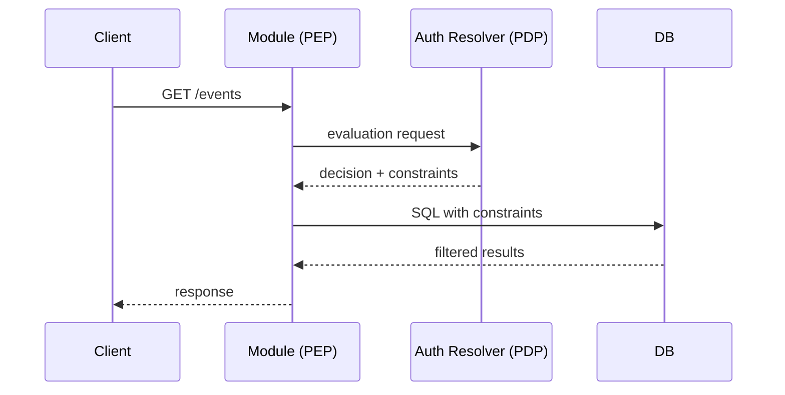

# Authentication & Authorization Design

## Overview

This document describes HyperSpot's approach to authentication (AuthN) and authorization (AuthZ).

**Authentication** verifies the identity of the subject making a request. HyperSpot integrates with vendor's Identity Provider (IdP) to validate access tokens and extract subject identity.

**Authorization** determines what the authenticated subject can do. HyperSpot integrates with vendor's Policy Decision Point (PDP) to obtain access decisions and query-level constraints. The core challenge: HyperSpot modules need to enforce authorization at the **query level** (SQL WHERE clauses), not just perform point-in-time access checks. See [ADR 0001](../adrs/authorization/0001-pdp-pep-authorization-model.md) for the details.

### Auth Resolver: Gateway + Plugin Architecture

Since IdP and PDP are vendor-specific, HyperSpot cannot implement authentication and authorization directly. Instead, we use the **gateway + plugin** pattern:

- **Auth Resolver** — a HyperSpot gateway module that defines a unified interface for AuthN/AuthZ operations
- **Vendor Plugin** — implements the Auth Resolver interface, integrating with vendor's IdP and Authorization API

This allows HyperSpot domain modules (PEPs) to use a consistent API regardless of the vendor's identity and authorization infrastructure. Each vendor develops their own Auth Resolver plugin that bridges to their specific systems.

---

## Core Terms

- **Access Token** - Credential presented by the client to authenticate requests. Format is not restricted — can be opaque token (validated via introspection) or self-contained JWT. The key requirement: it must enable authentication and subject identification.
- **Subject / Principal** - Actor initiating the request (user or API client), identified via access token
- **Tenant** - Domain of ownership/responsibility and policy (billing, security, data isolation)
- **Subject Tenant** - Tenant the subject belongs to
- **Context Tenant** - Tenant scope root for the operation (may differ from subject tenant in cross-tenant scenarios)
- **Resource Owner Tenant** - Actual tenant owning the resource (`owner_tenant_id`)
- **Resource** - Object with owner tenant identifier
- **Resource Group** - Optional container for resources (project/workspace/folder)
- **Permission** - `{ resource_type, action }` - allowed operation identifier
- **Access Constraints** - Structured predicates returned by the PDP for query-time enforcement. NOT policies (which are stored vendor-side), but compiled, time-bound enforcement artifacts.
- **PDP (Policy Decision Point)** - Auth Resolver implementing authorization decisions
- **PEP (Policy Enforcement Point)** - HyperSpot domain modules applying constraints

---

# Authentication

*TBD*

---

# Authorization

## Why AuthZEN (and Why It's Not Enough)

We chose [OpenID AuthZEN Authorization API 1.0](https://openid.net/specs/authorization-api-1_0.html) (approved 2026-01-12) as the foundation for Auth Resolver. See [ADR 0001](../adrs/authorization/0001-pdp-pep-authorization-model.md) for the full analysis of considered options.

**Why AuthZEN:**
- Industry standard with growing ecosystem
- Vendor-neutral: doesn't dictate policy model (RBAC/ABAC/ReBAC)
- Clean subject/action/resource/context structure
- Extensible via `context` field

However, AuthZEN out of the box doesn't solve HyperSpot's core requirement: **query-level authorization**.

### Why Access Evaluation API Alone Isn't Enough

AuthZEN's Access Evaluation API answers: "Can subject S perform action A on resource R?" — a point-in-time check returning `decision: true/false`.

#### LIST Operations

For **LIST operations** with Access Evaluation API, we'd need an iterative process:

1. Fetch a batch of resources from DB (e.g., `LIMIT 100` to get candidates for a page of 10)
2. Send batch to PDP for evaluation (AuthZEN supports batching via Access Evaluations API)
3. Filter results based on decisions
4. If filtered result < requested page size → fetch next batch, repeat

**The core problem**: unpredictable number of iterations. If the user has access to only 1% of resources, fetching a page of 10 items might require 10+ round-trips (DB → PDP → filter → not enough → repeat). Worst case: user has access to nothing, and we scan the entire table before returning empty result.

**Additional problems:**
- **Pagination cursor invalidation** — cursor points to DB offset, but after filtering the mapping breaks
- **Total count impossible** — can't know total accessible count without evaluating all resources
- **Inconsistent page sizes** — hard to guarantee exactly N items per page

#### Point Operations (GET/UPDATE/DELETE)

For **point operations**, Access Evaluation API could technically work, but requires an inefficient flow:

1. Query database to fetch the resource
2. Send resource to PDP for evaluation
3. If denied, return 403/404

**The problem**: the subject might not have rights to access this resource type at all. The database query is wasteful — we should fail fast before touching the database.

**What we want instead:**
1. Ask PDP first: "Can subject S perform action A on resource type T?"
2. If denied → 403 immediately (fail-fast, no database query)
3. If allowed → get constraints, execute query with `WHERE id = :id AND (constraints)`
4. If 0 rows → 404 (hides resource existence from unauthorized users)

### Why Search API Doesn't Work

AuthZEN's Resource Search API answers: "What resources can subject S perform action A on?" — returning a list of resource IDs.

This **assumes the PDP has access to resource data**. In HyperSpot's architecture, resources live in the PEP's database — the PDP cannot enumerate what it doesn't have.

This creates an architectural mismatch:
- **PDP** knows "who can access what" (authorization policies)
- **PEP** knows "what exists" (resources in database)

To use Search API, we'd need to sync all resources to the PDP — defeating the purpose of keeping data local.

### Our Solution: Extended Evaluation Response

We extend AuthZEN's evaluation response with optional `context.constraints`. Instead of returning resource IDs (enumeration), the PDP returns **predicates** that the PEP compiles to SQL WHERE clauses:

```jsonc
// PDP response
{
  "decision": true,
  "context": {
    "constraints": [{
      "filters": [
        { "type": "tenant_ownership", "op": "in_closure", "ancestor_id": "tenant-123", "respect_barrier": true }
      ]
    }]
  }
}
// PEP compiles to: WHERE owner_tenant_id IN (SELECT descendant_id FROM tenant_closure WHERE ancestor_id = 'tenant-123')
// Result: SELECT * FROM events WHERE (constraints) LIMIT 10 — correct pagination!
```

This gives us:
- **O(1) authorization overhead** per query (single PDP call)
- **Correct pagination** — constraints applied at SQL level before LIMIT
- **Accurate counts** — database handles filtering
- **No resource sync** — PDP never needs to know about individual resources

---

## Integration Architecture

```
+---------------------------------------------------------------------+
|                        Vendor Platform                              |
|  +----------+  +-----------------+  +------------+  +------------+  |
|  |   IdP    |  | Tenant Service  |  |  RG Svc    |  | Authz Svc  |  |
|  +----^-----+  +-------^---------+  +-----^------+  +-----^------+  |
+-------+----------------+------------------+---------------+---------+
        |                |                  |               |
+-------+----------------+------------------+---------------+---------+
|       |         HyperSpot                 |               |         |
|  +----+----+  +--------+--------+  +------+-----+  +------+------+  |
|  |  AuthN  |  | Tenant Resolver |  | RG Resolver|  |Auth Resolver|  |
|  | (JWT/   |  |    (Gateway)    |  |  (Gateway) |  |   (PDP)     |  |
|  | Introsp)|  +--------+--------+  +------+-----+  +------+------+  |
|  +---------+           |                  |               |         |
|                        v                  v               |         |
|              +-------------------------------+            |         |
|              |     Local Projections         |            |         |
|              |  * tenant_closure             |            |         |
|              |  * resource_group_closure     |            |         |
|              |  * resource_group_membership  |            |         |
|              +-------------------------------+            |         |
|                                                           |         |
|  +-------------------------------------------------------+-------+ |
|  |                    Domain Module (PEP)                 |       | |
|  |  +-------------+                                       |       | |
|  |  |   Handler   |---- /access/v1/evaluation ----------->|       | |
|  |  +------+------+     (returns decision + constraints)          | |
|  |         | Compile constraints to SQL                           | |
|  |         v                                                      | |
|  |  +-------------+                                               | |
|  |  |  Database   |  WHERE owner_tenant_id IN (...)               | |
|  |  +-------------+                                               | |
|  +----------------------------------------------------------------+ |
+---------------------------------------------------------------------+
```

---

## PEP Enforcement

### Unified PEP Flow

All operations (LIST, GET, UPDATE, DELETE) follow the same flow:



The only difference between LIST and point operations (GET/UPDATE/DELETE) is whether `resource.id` is present.

### Constraint Compilation to SQL

When constraints are present, the PEP compiles the `filters` array to SQL WHERE clauses:

1. **Filters within a constraint** are AND'd together
2. **Multiple constraints** (alternatives) are OR'd together
3. **Unknown filter types** cause that constraint to be treated as false (fail-closed)

### Fail-Closed Rules

The PEP MUST:

1. **Validate decision** - `decision: false` or missing -> deny all (403 Forbidden)
2. **Enforce require_constraints** - If `require_constraints: true` and `decision: true` but no `constraints` -> deny all (403 Forbidden)
3. **Apply constraints when present** - If `constraints` array is present, apply to SQL; if all constraints evaluate to false -> deny all
4. **Trust decision when constraints not required** - `decision: true` without `constraints` AND `require_constraints: false` -> allow (e.g., CREATE operations)
5. **Handle unreachable PDP** - Network failure, timeout -> deny all
6. **Handle unknown filter types** - Treat containing constraint as false; if all constraints false -> deny all
7. **Handle unknown filter ops** - Treat containing constraint as false
8. **Handle missing required fields** - Treat containing constraint as false
9. **Handle unknown field names** - Treat containing constraint as false (PEP doesn't know how to map)

---

## API Specifications

### Access Evaluation API (AuthZEN-extended)

Two endpoints for authorization checks, following AuthZEN structure:

- `POST /access/v1/evaluation` - Single evaluation request
- `POST /access/v1/evaluations` - Batch evaluation (array of requests -> array of responses)

PDP returns `decision` plus optional `constraints` for each evaluation.

#### Design Principles

1. **AuthZEN alignment** - Use same `subject`, `action`, `resource`, `context` structure
2. **Constraints are optional** - PDP decides when to include based on action type
3. **Constraint-first** - Return predicates, not enumerated IDs
4. **Capability negotiation** - PEP declares enforcement capabilities
5. **Fail-closed** - Unknown constraints or schemas result in deny
6. **OR/AND semantics** - Multiple constraints are OR'd (alternative access paths), filters within constraint are AND'd

#### Request

```
POST /access/v1/evaluation
Content-Type: application/json
```

```jsonc
{
  // AuthZEN standard fields
  "subject": {
    "type": "gts.x.core.security.subject.user.v1~",
    "id": "a254d252-7129-4240-bae5-847c59008fb6",
    "properties": {
      "tenant_id": "51f18034-3b2f-4bfa-bb99-22113bddee68"
    }
  },
  "action": {
    "name": "list"  // or "read", "update", "delete", "create"
  },
  "resource": {
    "type": "gts.x.events.event.v1~",
    "id": "e81307e5-5ee8-4c0a-8d1f-bd98a65c517e",  // present for point ops, absent for list
    "properties": {
      "topic_id": "gts.x.core.events.topic.v1~z.app._.some_topic.v1"
    }
  },

  // HyperSpot extension: context with tenant scope and PEP capabilities
  "context": {
    // Tenant scope configuration
    "tenant_scope": {
      "root_id": "51f18034-3b2f-4bfa-bb99-22113bddee68",
      "include_self": true,
      "depth": "descendants",      // "none" | "children" | "descendants"
      "respect_barrier": true,     // honor self_managed barrier in hierarchy traversal
      "tenant_status": ["active", "suspended"]  // optional, filters by tenant status
    },

    // PEP capabilities: what the caller can enforce locally
    "capabilities": {
      "require_constraints": true,              // if true, decision without constraints = deny
      "local_tenant_closure": true,              // can use tenant_closure table
      "local_resource_group_membership": true,  // can use resource_group_membership table
      "local_resource_group_closure": true      // can use resource_group_closure table
    }
  }
}
```

#### Response

The response contains a `decision` and, when `decision: true`, optional `context.constraints`. Each constraint contains a `filters` array of typed filter objects that the PEP compiles to SQL.

```jsonc
{
  "decision": true,
  "context": {
    // Multiple constraints are OR'd together (alternative access paths)
    "constraints": [{
      // Filters within a constraint are AND'd together
      "filters": [
        {
          // Tenant ownership filter - uses local tenant_closure table
          "type": "tenant_ownership",
          "op": "in_closure",
          "ancestor_id": "51f18034-3b2f-4bfa-bb99-22113bddee68",
          "respect_barrier": true,
          "tenant_status": ["active", "suspended"]
        },
        {
          // Simple column equality from resource properties
          "type": "field",
          "field": "resource.topic_id",
          "op": "eq",
          "value": "gts.x.core.events.topic.v1~z.app._.some_topic.v1"
        }
      ]
    }]
  }
}
```

#### PEP Decision Matrix

| `decision` | `constraints` | `require_constraints` | PEP Action |
|------------|---------------|----------------------|------------|
| `false` | (any) | (any) | **403 Forbidden** |
| `true` | absent | `false` | Allow (trust PDP decision) |
| `true` | absent | `true` | **403 Forbidden** (constraints required but missing) |
| `true` | present | (any) | Apply constraints to SQL |

**Key insight:** PEP declares via `require_constraints` capability whether it needs constraints for the operation. For LIST operations, this should typically be `true`; for CREATE, it can be `false`.

#### Operation-Specific Behavior

**CREATE** (no constraints needed):
```jsonc
// PEP -> PDP
{
  "action": { "name": "create" },
  "resource": {
    "type": "gts.x.events.event.v1~",
    "properties": { "owner_tenant_id": "tenant-B", "topic_id": "..." }
  }
  // ... subject, context
}

// PDP -> PEP
{ "decision": true }  // no constraints - PEP trusts decision

// PEP: INSERT INTO events ...
```

**LIST** (constraints required):
```jsonc
// PEP -> PDP
{
  "action": { "name": "list" },
  "resource": { "type": "gts.x.events.event.v1~" }  // no id
  // ... subject, context
}

// PDP -> PEP
{
  "decision": true,
  "context": {
    "constraints": [{
      "filters": [
        { "type": "tenant_ownership", "op": "in_closure", "ancestor_id": "tenant-A", "respect_barrier": true }
      ]
    }]
  }
}

// PEP: SELECT * FROM events WHERE (constraints)
```

**GET/UPDATE/DELETE** (constraints for SQL-level enforcement):
```jsonc
// PEP -> PDP
{
  "action": { "name": "read" },
  "resource": { "type": "gts.x.events.event.v1~", "id": "evt-123" }
  // ... subject, context
}

// PDP -> PEP
{
  "decision": true,
  "context": {
    "constraints": [{
      "filters": [
        { "type": "tenant_ownership", "op": "in_closure", "ancestor_id": "tenant-A", "respect_barrier": true }
      ]
    }]
  }
}

// PEP: SELECT * FROM events WHERE id = :id AND (constraints)
// 0 rows -> 404 (hides resource existence)
```

#### Response with Resource Group Filter

```jsonc
{
  "decision": true,
  "context": {
    "constraints": [{
      "filters": [
        {
          // Tenant ownership filter
          "type": "tenant_ownership",
          "op": "in_closure",
          "ancestor_id": "tenant-A",
          "respect_barrier": true
        },
        {
          // Resource group membership with closure - uses resource_group_membership + resource_group_closure tables
          "type": "group_membership",
          "op": "in_closure",
          "ancestor_id": "project-root-group"
        }
      ]
    }]
  }
}
```

#### Deny Response

```jsonc
{
  "decision": false
}
```

---

## Filter Types Reference

The following filter types can appear in the `filters` array. There are **three distinct filter types**, each with specific semantics:

| Filter Type | Description | Operations |
|-------------|-------------|------------|
| `field` | Simple column comparisons on resource properties | `eq`, `in` |
| `tenant_ownership` | Tenant hierarchy filtering | `in`, `in_closure` |
| `group_membership` | Resource group membership filtering | `in`, `in_closure` |

### 1. Field Filter (`type: "field"`)

Simple operations on resource columns. Filter fields use **logical names** (DSL), not physical column names. PEP maps logical fields to actual database columns.

**Schema:**
- `type` (required): `"field"`
- `field` (required): Logical field name in DSL format (`resource.<property>`)
- `op` (required): `"eq"` | `"in"`
- `value` (required for `op: eq`): Single value
- `values` (required for `op: in`): Array of values

```jsonc
// Equality
{ "type": "field", "field": "resource.topic_id", "op": "eq", "value": "uuid-123" }
// PEP maps resource.topic_id -> topic_id column
// SQL: topic_id = 'uuid-123'

// IN list
{ "type": "field", "field": "resource.status", "op": "in", "values": ["active", "pending"] }
// SQL: status IN ('active', 'pending')
```

**Field naming convention (DSL):**

| Prefix | Maps To | Example |
|--------|---------|---------|
| `resource.<property>` | Resource table column | `resource.topic_id` -> `topic_id` |

PEP maintains mapping from logical field names to physical schema. PDP uses only logical names — **it doesn't know the database schema**.

### 2. Tenant Ownership Filter (`type: "tenant_ownership"`)

Filters resources by tenant hierarchy. The tenant column name in the resource table is configured at the module level when setting up the SQL builder (default: `owner_tenant_id`). Different resources may have different tenant columns (e.g., `owner_tenant_id`, `billing_tenant_id`).

**Schema:**
- `type` (required): `"tenant_ownership"`
- `op` (required): `"in"` | `"in_closure"`
- `values` (required for `op: in`): Array of tenant IDs
- `ancestor_id` (required for `op: in_closure`): Root of tenant subtree
- `respect_barrier` (optional for `op: in_closure`): Honor `self_managed` barrier in hierarchy traversal, default `false`
- `tenant_status` (optional for `op: in_closure`): Filter by tenant status

```jsonc
// Explicit tenant IDs
{ "type": "tenant_ownership", "op": "in", "values": ["tenant-1", "tenant-2"] }
// SQL: owner_tenant_id IN ('tenant-1', 'tenant-2')

// Tenant closure (requires local_tenant_closure capability)
{
  "type": "tenant_ownership",
  "op": "in_closure",
  "ancestor_id": "tenant-A",
  "respect_barrier": true,
  "tenant_status": ["active", "suspended"]
}
// SQL: owner_tenant_id IN (
//   SELECT descendant_id FROM tenant_closure
//   WHERE ancestor_id = 'tenant-A'
//     AND (barrier_ancestor_id IS NULL OR barrier_ancestor_id = 'tenant-A')
//     AND descendant_status IN ('active', 'suspended')
// )
```

### 3. Group Membership Filter (`type: "group_membership"`)

Filters resources by resource group hierarchy. The resource ID column in the resource table is configured at the module level when setting up the SQL builder (default: `id`). The library uses this column for join with `resource_group_membership.resource_id`.

**Schema:**
- `type` (required): `"group_membership"`
- `op` (required): `"in"` | `"in_closure"`
- `values` (required for `op: in`): Array of group IDs
- `ancestor_id` (required for `op: in_closure`): Root of group subtree

```jsonc
// Explicit group IDs (requires local_resource_group_membership capability)
{ "type": "group_membership", "op": "in", "values": ["group-1", "group-2"] }
// SQL: id IN (
//   SELECT resource_id FROM resource_group_membership
//   WHERE group_id IN ('group-1', 'group-2')
// )

// Group closure (requires local_resource_group_closure capability)
{ "type": "group_membership", "op": "in_closure", "ancestor_id": "root-group" }
// SQL: id IN (
//   SELECT resource_id FROM resource_group_membership
//   WHERE group_id IN (
//     SELECT descendant_id FROM resource_group_closure
//     WHERE ancestor_id = 'root-group'
//   )
// )
```

---

## Capabilities -> Filter Matrix

The PEP declares its capabilities in the request. This determines what filter operations the PDP can return:

| Capability | When `false` | When `true` |
|------------|--------------|-------------|
| `require_constraints` | `decision: true` without constraints = allow | `decision: true` without constraints = **deny** |
| `local_tenant_closure` | PDP returns `tenant_ownership, op: in` with explicit tenant IDs | PDP can return `tenant_ownership, op: in_closure` |
| `local_resource_group_membership` | PDP cannot return `type: group_membership` filters | PDP can return `group_membership` filters |
| `local_resource_group_closure` | PDP returns `group_membership, op: in` with explicit group IDs | PDP can return `group_membership, op: in_closure` |

**Filter type availability by capability:**

| Filter Type | Operation | Required Capability |
|-------------|-----------|---------------------|
| `field` | `eq`, `in` | (none - always available) |
| `tenant_ownership` | `in` | (none - always available) |
| `tenant_ownership` | `in_closure` | `local_tenant_closure` |
| `group_membership` | `in` | `local_resource_group_membership` |
| `group_membership` | `in_closure` | `local_resource_group_membership` + `local_resource_group_closure` |

**`require_constraints` usage:**
- For LIST operations: typically `true` (constraints needed for SQL WHERE)
- For CREATE operations: typically `false` (no query, just permission check)
- For GET/UPDATE/DELETE: depends on whether PEP wants SQL-level enforcement or trusts PDP decision

**Capability degradation**: If a PEP lacks a capability, the PDP must either:
1. Expand the filter to explicit IDs (may be large)
2. Return `decision: false` if expansion is not feasible

---

## Table Schemas (Local Projections)

These tables are maintained locally by HyperSpot gateway modules (Tenant Resolver, Resource Group Resolver) and used by PEPs to execute constraint queries efficiently without calling back to the vendor platform.

### `tenant_closure`

Denormalized closure table for tenant hierarchy. Enables efficient subtree queries without recursive CTEs.

| Column | Type | Nullable | Description |
|--------|------|----------|-------------|
| `ancestor_id` | UUID | No | Parent tenant in the hierarchy |
| `descendant_id` | UUID | No | Child tenant (the one we check ownership against) |
| `barrier_ancestor_id` | UUID | Yes | ID of tenant with `self_managed=true` between ancestor and descendant (NULL if no barrier) |
| `descendant_status` | TEXT | No | Status of descendant tenant (`active`, `suspended`, `deleted`) |

**Notes:**
- Status is denormalized into closure for query simplicity (avoids JOIN). When a tenant's status changes, all rows where it is `descendant_id` are updated.
- The `barrier_ancestor_id` column enables `respect_barrier` filtering: when set, only include descendants where `barrier_ancestor_id IS NULL OR barrier_ancestor_id = :ancestor_id`.
- Self-referential rows exist: each tenant has a row where `ancestor_id = descendant_id`.

**Example query (tenant_ownership with in_closure):**
```sql
SELECT * FROM events
WHERE owner_tenant_id IN (
  SELECT descendant_id FROM tenant_closure
  WHERE ancestor_id = :ancestor_id
    AND (barrier_ancestor_id IS NULL OR barrier_ancestor_id = :ancestor_id)  -- respect_barrier
    AND descendant_status IN ('active', 'suspended')  -- tenant_status filter
)
```

### `resource_group_closure`

Closure table for resource group hierarchy. Similar structure to tenant_closure but simpler (no barrier or status).

| Column | Type | Nullable | Description |
|--------|------|----------|-------------|
| `ancestor_id` | UUID | No | Parent group |
| `descendant_id` | UUID | No | Child group |

**Notes:**
- Self-referential rows exist: each group has a row where `ancestor_id = descendant_id`.
- Used for `group_membership, op: in_closure` filter expansion.

### `resource_group_membership`

Association between resources and groups. A resource can belong to multiple groups.

| Column | Type | Nullable | Description |
|--------|------|----------|-------------|
| `resource_id` | UUID | No | ID of the resource (FK to resource table) |
| `group_id` | UUID | No | ID of the group (FK to resource_group_closure) |

**Notes:**
- The `resource_id` column joins with the resource table's ID column (configurable per module, default `id`).
- Used for both `group_membership, op: in` and `group_membership, op: in_closure` filters.

**Example query (group_membership with in_closure):**
```sql
SELECT * FROM events
WHERE id IN (
  SELECT resource_id FROM resource_group_membership
  WHERE group_id IN (
    SELECT descendant_id FROM resource_group_closure
    WHERE ancestor_id = :ancestor_id
  )
)
```

---

## Open Questions

1. **"Allow all" semantics** - Should there be a way for PDP to express "allow all resources of this type" (e.g., for platform support roles)? Currently, constraints must have concrete filters. Future consideration: `filters: []` with explicit "allow all" semantics.

2. **Empty `filters` interpretation** - If a constraint has an empty `filters: []` array, should it mean "match all" or "match none"? Currently undefined.

3. **Batch evaluation optimization** - We support `/access/v1/evaluations` for batch requests. Should PDP optimize constraint generation when multiple evaluations share the same subject/context? Use cases: bulk operations, permission checks for UI rendering.

4. **Constraint caching** - Can constraints be cached at the PEP level beyond TTL? What invalidation signals are needed?

5. **AuthZEN context structure** - Is embedding HyperSpot-specific fields in `context` the right approach, or should we use a dedicated extension namespace?

6. **IANA registration** - Should HyperSpot register its extension parameters with the AuthZEN metadata registry?

7. **AuthZEN Search API relationship** - Our extended evaluation response serves similar purposes to Resource Search. Should we document this as a constraint-based alternative, or position it separately?

---

## References

- [OpenID AuthZEN Authorization API 1.0](https://openid.net/specs/authorization-api-1_0.html) (approved 2026-01-12)
- [ADR 0001: PDP/PEP Authorization Model](../adrs/authorization/0001-pdp-pep-authorization-model.md)
- [HyperSpot GTS (Global Type System)](../../modules/types-registry/)
