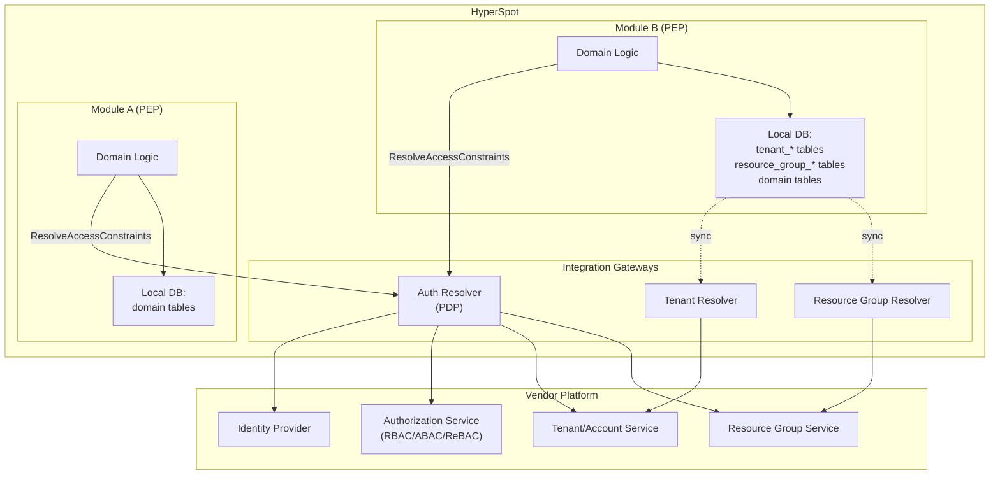

# ADR: HyperSpot Integration Gateways for Tenants, Resource Groups, and Authorization

- Status: Proposed  
- Date: 2026-01-19  
- Decision Drivers: Multi-tenant vendor integration, vendor-neutral authorization, scalable data-level enforcement, pluggable modular architecture

## Table of Contents

- [Context](#context)
- [Decision](#decision)
- [Core Terms](#core-terms)
- [Non-Core Vendor Concepts](#non-core-vendor-concepts-for-understanding-only)
- [Global Type System (GTS)](#global-type-system-gts)
- [Tenant Resolver (Gateway)](#tenant-resolver-gateway)
- [Resource Group Resolver (Gateway)](#resource-group-resolver-gateway)
- [Auth Resolver (Gateway)](#auth-resolver-gateway)
- [ResolveAccessConstraints: Command Contract](#resolveaccessconstraints-command-contract-pdp--pep)
- [Rationale](#rationale)
  - [Why Tenant Resolver Exists Alongside Resource Group Resolver](#why-tenant-resolver-exists-alongside-resource-group-resolver)
  - [Alternatives Considered](#alternatives-considered)
    - [OPA Partial Evaluation](#opa-partial-evaluation)
    - [OpenID AuthZEN](#openid-authzen)
    - [Summary of Alternatives](#summary-of-alternatives)
- [Consequences](#consequences)
- [Validation](#validation)
  - [Database Prerequisites](#database-prerequisites)
  - [Scenarios](#scenarios)
    - [Scenario 1: Same-Tenant Access (Read One)](#scenario-1-same-tenant-access-read-one)
    - [Scenario 2: Same-Tenant Access (List)](#scenario-2-same-tenant-access-list)
    - [Scenario 3: Tenant Subtree Access (Read One)](#scenario-3-tenant-subtree-access-read-one)
    - [Scenario 4: Tenant Subtree Access Without Closure (Read One)](#scenario-4-tenant-subtree-access-without-closure-read-one)
    - [Scenario 5: Tenant Subtree Access (List)](#scenario-5-tenant-subtree-access-list)
    - [Scenario 6: Tenant Subtree Access Without Closure (List)](#scenario-6-tenant-subtree-access-without-closure-list)
    - [Scenario 7: Same-Tenant + Resource Group Access (Read One)](#scenario-7-same-tenant--resource-group-access-read-one)
    - [Scenario 8: Same-Tenant + Resource Group Access (List)](#scenario-8-same-tenant--resource-group-access-list-multiple-groups)
    - [Scenario 9: Tenant Subtree + Resource Group Access (List)](#scenario-9-tenant-subtree--resource-group-access-list)
    - [Scenario 10: Resource Group Hierarchy (List)](#scenario-10-resource-group-hierarchy-list)
    - [Scenario 11: Resource Group Access Without Membership Projection (Dummy Module)](#scenario-11-resource-group-access-without-membership-projection-dummy-module)
    - [Scenario 12: Create in Same-Tenant](#scenario-12-create-in-same-tenant)
    - [Scenario 13: Create in Child Tenant (Cross-Tenant)](#scenario-13-create-in-child-tenant-cross-tenant)
    - [Scenario 14: Create Denied (No Permission)](#scenario-14-create-denied-no-permission)
    - [Scenario 15: Multiple Alternatives with Explicit Resource IDs (OR Logic)](#scenario-15-multiple-alternatives-with-explicit-resource-ids-or-logic)
- [Scenario 16: Filter-Narrowed Tenant Scope Intent](#scenario-16-filter-narrowed-tenant-scope-intent)
    - [Scenario 17: Attribute Filtering with Self-Managed Barrier](#scenario-17-attribute-filtering-with-self-managed-barrier)

## Context

HyperSpot is a pluggable, modular platform intended to be embedded into other multi-tenant vendor platforms. Each vendor can have its own identity provider (IdP), authorization model, and an Account/Tenant service that is the system of record for tenant metadata and hierarchy.

HyperSpot must integrate with these vendor-specific systems without assuming a particular policy model (RBAC/ABAC/ReBAC), storage mechanism (ACL tables, policy documents, relationship graphs), or hierarchy representation. At the same time, HyperSpot modules must enforce authorization efficiently at the data layer (e.g., by constructing SQL predicates).

This ADR defines the gateway integration points and the shared vocabulary used across HyperSpot contributors.

## Decision

We introduce three gateway integration points:

1. Tenant Resolver (gateway)  
2. Resource Group Resolver (gateway)  
3. Auth Resolver (gateway)

Auth Resolver is the Policy Decision Point (PDP) for HyperSpot. HyperSpot domain modules act as Policy Enforcement Points (PEPs) by applying the returned constraints when querying or mutating data using common modkit library.



## Core Terms

- **Tenant**
  A domain of ownership/responsibility and policy (billing, security settings, default data isolation). Cross-tenant access is granted via explicit delegations, not by transferring ownership.

- **Subject / Principal**
  The actor initiating the request (user or API client). In cross-tenant scenarios, it is critical to distinguish where the subject belongs vs where the subject is acting.

- **Subject Tenant**
  The tenant the subject/principal belongs to.

- **Context Tenant**
  The tenant in whose context the request is being processed; the scope root for authorization. This is the tenant boundary within which the operation is authorized. In cross-tenant scenarios, the context tenant may differ from the subject tenant (e.g., when a parent tenant user operates within a child tenant's scope).

- **Resource Owner Tenant**
  The actual tenant that owns the resource (`owner_tenant_id` column). May equal the context tenant, or be a descendant of it when `context_tenant_and_descendants` scope is used.

- **Resource**
  An object with an owner tenant identifier (owner_tenant_id). Authorization checks follow the pattern: principal performs an operation on a resource.

- **Resource Group**
  An optional core primitive representing a container for resources to simplify access management and lifecycle (e.g., project/workspace/folder). A resource may belong to multiple resource groups simultaneously. Some vendors provide resource-group hierarchy (often implemented using a closure table). If a vendor does not support resource groups, this concept is not used.

- **Permission**
  An identifier of an allowed operation, independent of a specific subject or resource instance. A permission is defined as { resource_type: <GTS type id>, action: <action> }. resource_type is a GTS type identifier or GTS type query. action MAY be a string in v1, and MAY evolve into a GTS-typed identifier in future versions to support vendor-safe extension of action vocabularies.

- **Access Constraints**
  * Computed applicability constraints for a permission in the context of a specific request. In other words: “Which tenants/resources can this operation apply to right now?” This is the output of `ResolveAccessConstraints` in Auth Resolver.
   * Access Constraints are expressed as structured predicates/filters (not necessarily enumerated IDs), used by HyperSpot modules to build safe SQL (or other enforcement). Constraints are time-bound (TTL) and valid at evaluation time.
   * Access Constraints are NOT Access Policies. Policies are stored vendor-side (RBAC/ABAC/ReBAC, grants, relationship graphs, etc.). Access Constraints are *request-scoped, time-bound enforcement artifacts* produced by evaluating policies for a specific request and compiling them into a form enforceable by the PEP (SQL predicates, scope restrictions, and guardrails).

## Non-Core Vendor Concepts (for understanding only)

These concepts may exist in vendor systems but HyperSpot must not depend on them directly:

- **Role**
  A named bundle of permissions assigned to users/groups for administration convenience.

- **Authorization Model / Policy Model**
  How access rules are expressed and stored by the vendor (RBAC/ABAC/ReBAC, Zanzibar-style relationship graphs, Cedar/OPA policies, ACL-like grants, or hybrids). HyperSpot must integrate without assuming a specific model or storage mechanism.

## Global Type System (GTS)
HyperSpot uses a Global Type System (GTS) and a Type Registry as the authoritative source of truth for all shared type identifiers used across gateways and modules. In particular, tenant_type, resource_type, subject_type (and other type-like identifiers) are GTS type identifiers. This enables vendor-safe extensibility, compatibility checks, and consistent interpretation of typed payloads across integrations.

## Tenant Resolver (Gateway)

### Responsibility

Tenant Resolver integrates with the vendor’s tenant/account system and provides tenant metadata and tenant hierarchy.

Across integrations, tenant topology is a forest.

### Expected Capabilities

- Read a tenant by ID  
- List children for a tenant (with filtering and pagination as needed)  
- List parents for a tenant  

Each tenant includes at minimum:

- Identifier
- Type
- Status
- Management mode (e.g., managed vs self-managed)
- Name
- Parent identifier

Management mode does not grant access by itself; it is a policy input used to validate delegations and enforce vendor rules.

### Local Projections in Domain Modules

For efficient authorization and data-layer enforcement in large hierarchies, HyperSpot deployments may maintain a local tenant-closure projection (ancestor/descendant relationships).

- Projection population is expected to be driven primarily by event-driven sync from Tenant Resolver (normalized tenant create/update/move events), with optional periodic reconciliation as a safety net.
- If the vendor cannot provide events, polling-based sync may be used with clearly defined staleness bounds.
- Modules and Auth Resolver integrations that rely on subtree semantics should explicitly document whether they depend on this closure projection and how they behave under eventual consistency.

## Resource Group Resolver (Gateway)

### Responsibility

Resource Group Resolver integrates with the vendor’s resource-group model (projects/workspaces/folders, etc.), including resource-to-group membership (many-to-many) and group hierarchy (if present).

### Expected Capabilities

- Read a resource group by ID  
- Resolve group hierarchy relationships (parents/children/descendants as needed)  
- Resolve resource-to-group membership (many-to-many)  
- Provide normalized updates (events) so domain modules can keep local projections in sync

### Local Projections in Domain Modules

For efficient enforcement (especially LIST endpoints), domain modules may maintain local projection tables (or equivalent) such as:

- Resource-to-group membership projection that enables fast JOIN/EXISTS checks  
- Optionally, group-closure projection if group hierarchy is required for enforcement  

Projection population is expected to be driven primarily by event-driven sync from Resource Group Resolver (with optional write-through on HyperSpot-initiated changes and periodic reconciliation as a safety net).

## Auth Resolver (Gateway)

### Responsibility

Auth Resolver provides authentication (AuthN) and authorization (AuthZ). For authorization, it is the Policy Decision Point (PDP) returning decisions and enforceable Access Constraints. HyperSpot modules apply these constraints as PEPs.

### Authentication

HyperSpot authentication can be configured in two ways:

- Always delegate authentication to Auth Resolver (vendor-specific tokens/sessions supported; may use token introspection for opaque tokens)  
- Accept only JWT Bearer tokens validated locally (requires vendor IdP to support OpenID Connect discovery and JWKs)

When vendor tokens are opaque (non-JWT) or require near-real-time revocation, Auth Resolver may validate them via token introspection (or equivalent vendor APIs) and return a normalized subject identity and tenant context.

Required normalized authentication output (beyond standard token claims):

- Subject identifier  
- Subject type  
- Subject tenant identifier  
- Subject tenant type  

### Authorization

Auth Resolver provides `ResolveAccessConstraints`.

`ResolveAccessConstraints` performs policy evaluation and produces enforcement-ready constraints (a compiled decision artifact), not reusable policy definitions.

Access Constraints may include:

- Tenant scope constraints (e.g., context tenant only, context tenant plus descendants, managed subtree only)  
- Resource-level constraints expressed as structured predicates/filters  
- Resource-group constraints (when vendor policies are group-based), expressed as structured constraints suitable for SQL enforcement (e.g., “resource must belong to at least one group within an allowed group scope”)  

Constraints are time-bound (TTL) and valid at evaluation time.

#### GTS-typed Access Constraints Contract
Access Constraints returned by `ResolveAccessConstraints` will be represented as a GTS-typed, versioned contract (schema registered in the Type Registry). This ensures that all modules interpret constraints consistently and can validate them before enforcement. Unknown constraint schema versions or unsupported constraint constructs MUST result in fail-closed behavior.

## ResolveAccessConstraints: Command Contract (PDP ↔ PEP)

This section defines the contract for `ResolveAccessConstraints` exposed by **Auth Resolver (PDP)** and consumed by HyperSpot domain modules acting as **PEPs**.

### Goals

- Return **enforceable** constraints for data-layer enforcement (SQL-first).
- Remain **vendor-neutral** (no RBAC/ABAC/ReBAC assumptions).
- Support multiple independent access paths via **OR** (`alternatives`).
- Fail-closed: unsupported schemas/dialects/fields/capabilities ⇒ deny.

---

### Semantics (Normative)

- The PEP MUST provide:
  - Subject identity and subject tenant
  - Requested permission (resource type + action)
  - Resource context (tenant/group) when applicable
  - Target selection (single resource vs query)
  - Enforcement capabilities (what the PEP can enforce)

- The PDP returns a decision artifact:
  - `alternatives[]` combined with `combine="OR"`
  - Each alternative is a conjunctive constraint set (AND):
    `effective_tenant_scope AND effective_group_scope AND effective_resource_scope`
  - Decision vs alternatives (Normative)
    - `decision="deny"` means final deny. The response MAY omit alternatives. If alternatives are present, they MUST be ignored by the PEP.
    - `decision="allow"` means conditionally allow, subject to enforcement:
      - The response MUST include a non-empty `alternatives[]`.
      - The PEP MUST treat each alternative as an enforceable constraint candidate.
      - If the PEP cannot enforce an alternative, it MUST treat that alternative as false.
      - The PEP MUST allow the request only if at least one alternative is enforceable and evaluates to true at the data layer.
    - If `decision="allow"` and alternatives are missing/empty ⇒ the PEP MUST deny (fail-closed).

- The PEP MUST:
  1. Validate `schema_id` via Type Registry; unknown ⇒ deny.
  2. Compile each alternative into SQL WHERE predicate (AND inside).
  3. Combine alternatives with OR.
  4. Treat any non-enforceable alternative as `false`.
  5. If all alternatives are `false`, deny (fail-closed).
  6. Enforce TTL (`ttl_seconds`) and never use expired constraints.

#### Error Handling (Normative)

- **PDP unavailability**: If the PEP cannot reach Auth Resolver (network failure, timeout, 5xx errors), the PEP MUST treat this as a **deny**. This is fail-closed behavior — no authorization decision means no access.
- **Malformed responses**: If the PDP returns a response that fails schema validation or contains unrecognized `schema_id`, the PEP MUST deny.
- **Timeouts**: PEPs SHOULD define reasonable timeouts for `ResolveAccessConstraints` calls. Timeout ⇒ deny.
- **Partial failures**: If `decision="allow"` but `alternatives` is malformed or unparseable, the PEP MUST deny.

> **Note on Actions**: The `action` field (`read`, `list`, `create`, `update`, `delete`) is passed to the PDP and influences policy evaluation, but the constraint response format and PEP enforcement mechanism are identical across all actions.
>
> **Create operations**: Since the resource doesn't exist yet, `intent_resource_scope` is omitted in the request. The returned constraints define which tenant(s) and/or resource group(s) the subject is authorized to create resources within.

#### Filter Intersection Logic

Filters narrow the base scope using AND semantics:

```
effective_scope = base_scope ∩ ids ∩ attributes_filter.status
```

**Example:**
```jsonc
"intent_tenant_scope": {
  "mode": "context_tenant_and_descendants",
  "attributes_filter": {
    "status": ["active", "grace_period"]
  }
},
"intent_resource_scope": {
  "attributes_filter": { "topic_id": "gts.x.core.events.topic.v1~z.app._.some_topic.v1" }
},
```

This means: "I want to access tenants within the context tenant's subtree, but only those with `active` status."

The PDP evaluates:
1. Start with the authorized tenant subtree (based on permission policy)
2. Intersect with any `ids` (if provided)
3. Filter by `attributes_filter.status` (if provided)
4. Return the resulting effective scope

#### Self-Managed Barrier Semantics

`management_mode` is NOT a simple filter. It acts as a **barrier** in hierarchy traversal:

```
Tenant A (managed)
├── Tenant B (self-managed)  ← BARRIER
│   ├── Tenant C (managed)   ← Hidden from A
│   └── Tenant D (managed)   ← Hidden from A
└── Tenant E (managed)       ← Visible to A
    └── Tenant F (managed)   ← Visible to A
```

**Barrier rule**: When traversing from `context_tenant_id`, stop at self-managed tenants. The self-managed tenant AND its entire subtree are hidden by default.

**`include_self_managed` flag**: Callers can explicitly opt-in to cross the self-managed barrier by setting `include_self_managed: true` in the request. However, the PDP has final say based on permission policy — some permissions may never allow crossing the barrier.

**Permission-dependent visibility**: Some permissions (e.g., "view usage billing") may ignore the barrier and see through to self-managed subtrees. The PDP determines this based on permission policy.

**Implementation options for barrier:**
1. **Closure table approach**: Add `barrier_ancestor_id` column that tracks the nearest self-managed ancestor (NULL if none). Query filters on this.
2. **Separate closure tables**: `tenant_closure_full` (all relationships) vs `tenant_closure_managed` (stops at self-managed barriers).
3. **Runtime CTE**: Recursive query that stops at self-managed boundaries.

#### PEP SQL Compilation

**For closure-based result (with barrier):**
```sql
-- Option 1: Using barrier_ancestor_id column
WHERE owner_tenant_id IN (
  SELECT tc.descendant_id
  FROM tenant_closure tc
  JOIN tenant_projection tp ON tc.descendant_id = tp.tenant_id
  WHERE tc.ancestor_id = :context_tenant_id
    AND tc.barrier_ancestor_id IS NULL  -- no self-managed in path
    AND tp.status IN ('active')
)

-- Option 2: Using separate managed-only closure table
WHERE owner_tenant_id IN (
  SELECT tc.descendant_id
  FROM tenant_closure_managed tc
  WHERE tc.ancestor_id = :context_tenant_id
)
```

**For `ids` narrowing:**
```sql
-- With closure + explicit IDs
WHERE owner_tenant_id IN (
  SELECT tc.descendant_id
  FROM tenant_closure tc
  WHERE tc.ancestor_id = :context_tenant_id
    AND tc.barrier_ancestor_id IS NULL
    AND tc.descendant_id IN (:id1, :id2, :id3)  -- ids
)
```

#### Group Scope SQL Compilation

Groups are constraints, not context. The PEP compiles `effective_group_scope` based on which fields are present:

| effective_group_scope | SQL |
|----------------------|-----|
| `{ "ids": [...] }` | `WHERE group_id IN (:id1, :id2)` |
| `{ "root_id": "X" }` | `WHERE group_id IN (SELECT descendant_id FROM resource_group_closure WHERE ancestor_id = 'X')` |
| `{ "root_id": "X", "ids": [...] }` | Intersection: `WHERE group_id IN (:ids) AND group_id IN (SELECT descendant_id FROM resource_group_closure WHERE ancestor_id = 'X')` |
| `null / absent` | No group constraint |

**Explicit group IDs:**
```sql
-- effective_group_scope.ids = ["group-1", "group-2"]
AND resource_id IN (
  SELECT resource_id FROM resource_group_membership
  WHERE group_id IN ('group-1', 'group-2')
)
```

**Hierarchy root (all descendants via closure):**
```sql
-- effective_group_scope.root_id = "dept-123"
AND resource_id IN (
  SELECT m.resource_id
  FROM resource_group_membership m
  WHERE m.group_id IN (
    SELECT descendant_id FROM resource_group_closure
    WHERE ancestor_id = 'dept-123'
  )
)
```

**Combined (intersection):**
```sql
-- effective_group_scope = { root_id: "dept-123", ids: ["team-alpha", "team-beta"] }
AND resource_id IN (
  SELECT m.resource_id
  FROM resource_group_membership m
  WHERE m.group_id IN ('team-alpha', 'team-beta')
    AND m.group_id IN (
      SELECT descendant_id FROM resource_group_closure
      WHERE ancestor_id = 'dept-123'
    )
)
```

#### Resource Scope SQL Compilation

Resources are simple constraints. The PEP compiles `effective_resource_scope` directly:

| effective_resource_scope | SQL |
|-------------------------|-----|
| `{ "ids": [...] }` | `AND resource_id IN (:id1, :id2)` |
| `null / absent` | No additional resource constraint |

**Explicit resource IDs:**
```sql
-- effective_resource_scope.ids = ["res-1", "res-2"]
AND resource_id IN ('res-1', 'res-2')
```

---

### Input

```jsonc
{
  "schema_id": "gts.x.security.resolve_access_constraints.request.v1~",

  // Subject context
  "subject_id": "a254d252-7129-4240-bae5-847c59008fb6",
  "subject_type": "gts.x.core.security.subject.user.v1~",
  "subject_tenant_id": "51f18034-3b2f-4bfa-bb99-22113bddee68",

  // Permission - resource type without embedded selectors
  "permission": {
    "resource_type": "gts.x.events.event.v1~",
    "action": "read"
  },

  // Tenant context - anchor point for the operation
  "context_tenant_id": "93953299-bcf0-4952-bc64-3b90880d6beb",

  // Intent scopes (what caller wants)
  "intent_tenant_scope": {
    "mode": "context_tenant_only",           // context_tenant_only | context_tenant_and_descendants
    "include_self_managed": false,           // OPTIONAL - default false (respects self-managed barrier)
    "ids": ["..."],                          // OPTIONAL - intersection with these tenant IDs
    "attributes_filter": {                   // OPTIONAL - attribute-based filtering (AND semantics)
      "status": ["active"]                   // e.g., ["active", "suspended"]
    }
  },

  // Group scope constraint - OPTIONAL (groups are constraints, not context)
  // Fields can be combined with AND semantics:
  //   - root_id alone: all groups in subtree
  //   - ids alone: exactly these groups
  //   - root_id + ids: intersection (ids must be within root_id subtree)
  "intent_group_scope": {
    "root_id": "aaa11111-1111-1111-1111-department111",  // OPTIONAL - hierarchy root
    "ids": ["bbb22222-...", "ccc33333-..."]              // OPTIONAL - explicit groups
  },
  // OR omit intent_group_scope entirely if no group constraint needed

  // Resource scope constraint - OPTIONAL
  // Fields can be combined with AND semantics
  "intent_resource_scope": {
    "ids": ["e81307e5-5ee8-4c0a-8d1f-bd98a65c517e"],     // OPTIONAL - specific resource IDs
    "attributes_filter": {                               // OPTIONAL - attribute-based filtering
      "topic_id": "gts.x.core.events.topic.v1~z.app._.some_topic.v1"
    }
  },
  // OR omit intent_resource_scope if no specific resource constraint

  // Capabilities (what the PEP can enforce)
  "capabilities": {
    "tenant_scope": {
      "supports_tenants_projection": true,
      "supports_descendants_via_closure": true   // barrier handling is implicit in closure
    },
    "group_scope": {
      "supports_membership_projection": true,
      "supports_descendants_via_closure": true
    }
  }
}
```

### Output

```jsonc
{
  "schema_id": "gts.x.security.resolve_access_constraints.response.v1~",
  "issued_at": "2026-01-19T10:00:00Z",
  "ttl_seconds": 60,
  "decision": "allow",                       // allow | deny

  // Subject context (echoed from request)
  "subject_id": "a254d252-7129-4240-bae5-847c59008fb6",
  "subject_type": "gts.x.core.security.subject.user.v1~",
  "subject_tenant_id": "51f18034-3b2f-4bfa-bb99-22113bddee68",

  // Permission (echoed from request)
  "permission": {
    "resource_type": "gts.x.events.event.v1~",
    "action": "read"
  },

  // Tenant context (echoed from request)
  "context_tenant_id": "93953299-bcf0-4952-bc64-3b90880d6beb",

  // Echo intents (for auditability)
  "intent_tenant_scope": { "mode": "context_tenant_only" },
  "intent_group_scope": { "ids": ["..."] },                                     // OPTIONAL
  "intent_resource_scope": {                                                    // OPTIONAL
    "ids": ["e81307e5-5ee8-4c0a-8d1f-bd98a65c517e"],
    "attributes_filter": { "topic_id": "gts.x.core.events.topic.v1~z.app._.some_topic.v1" }
  },

  // Enforceable constraints (PEP applies these)
  "alternatives": [
    {
      // Tenant scope: mode defines base, ids and attributes_filter narrow
      // context_tenant_id at response root provides the anchor
      "effective_tenant_scope": {
        "mode": "context_tenant_only",       // context_tenant_only | context_tenant_and_descendants | not_applicable
        "include_self_managed": false,       // was barrier applied?
        "ids": ["..."],                      // OPTIONAL - resolved allowed tenant IDs
        "attributes_filter": {               // OPTIONAL - attribute-based filtering
          "status": ["active"]               // tenant status filter applied
        }
      },

      // Group scope: constraint, not context (omit if no group constraint)
      // Fields can be combined with AND semantics (intersection)
      "effective_group_scope": {
        "root_id": "aaa11111-1111-1111-1111-department111",  // OPTIONAL - hierarchy root
        "ids": ["bbb22222-...", "ccc33333-..."]              // OPTIONAL - explicit groups
      },
      // OR null/absent = no group constraint

      // Resource scope: constraint (omit if no specific resource constraint)
      // Fields can be combined with AND semantics
      "effective_resource_scope": {
        "ids": ["e81307e5-5ee8-4c0a-8d1f-bd98a65c517e"],     // OPTIONAL - specific resources
        "attributes_filter": {                               // OPTIONAL - attribute-based filtering
          "topic_id": "gts.x.core.events.topic.v1~z.app._.some_topic.v1"
        }
      }
      // OR null/absent = all resources matching other constraints
    }
  ]
}
```

## Rationale

### Why Tenant Resolver Exists Alongside Resource Group Resolver

Tenant Resolver remains a first-class integration point even when a vendor provides resource groups, because tenants and resource groups serve different purposes:

- Tenant is the primary isolation and accountability boundary (billing, legal ownership, security defaults, lifecycle status). Resource groups are an optional organizational primitive and may not exist in some vendor platforms.
- Cross-tenant scenarios require explicit modeling of Subject Tenant vs Context Tenant vs Resource Owner Tenant. Even when resources are organized into groups, the tenant boundary still determines ownership and baseline isolation rules.
- Tenant attributes are policy inputs (status, tenant type, management mode, hierarchy) needed both by authorization decisions and by domain logic (e.g., blocked/suspended tenants).
- Group models are often many-to-many and may span multiple organizational axes, while tenant topology is typically more stable and consistently available across vendors.

Therefore, Resource Group Resolver complements (but does not replace) Tenant Resolver.

### Alternatives Considered

This section analyzes industry solutions that were considered and why HyperSpot defines its own Access Constraints contract rather than adopting them directly.

#### OPA Partial Evaluation

[Open Policy Agent (OPA)](https://www.openpolicyagent.org/) is a general-purpose policy engine using the Rego language. OPA's Partial Evaluation feature compiles policies with incomplete input into "residual policies" — a subset of the original policy that still needs to be evaluated once the missing data is available.

**How it works:**
```
Full Policy + Known Input (subject, action) 
    → Partial Evaluation 
    → Residual Policy (Rego AST with unknowns for resource attributes)
```

**Why OPA PE is not adopted as the contract format:**

| Aspect | OPA Partial Evaluation | HyperSpot Access Constraints |
|--------|------------------------|------------------------------|
| **Output format** | Rego AST (Abstract Syntax Tree) | Structured JSON with explicit modes |
| **PEP complexity** | Must parse and compile Rego AST to SQL | Simple switch/case on `mode` field |
| **Capability negotiation** | Not supported; PDP has no knowledge of PEP capabilities | Built-in: PEP declares `supports_closure`, PDP adapts |
| **Tenant hierarchy** | No primitive; must be modeled as data | First-class: `context_tenant_and_descendants` |
| **Resource group hierarchy** | No primitive; must be modeled as data | First-class: `resource_group_and_descendants` |
| **Type safety** | Free-form Rego; no schema enforcement | GTS-typed schemas in Type Registry |
| **Fail-closed guarantees** | Depends on Rego policy correctness | Structural: unknown schema → deny |

**OPA PE as an implementation backend:**

OPA PE remains a valid choice for Auth Resolver *implementation*. The architecture would be:

```
Vendor Policy (RBAC/ABAC/ReBAC)
    ↓ (translated to Rego)
OPA Engine (inside Auth Resolver)
    ↓ (Partial Evaluation)
Rego Residual
    ↓ (compiled by Auth Resolver)
Access Constraints contract (what PEPs consume)
```

This approach:
- Leverages OPA's mature policy evaluation and tooling
- Keeps the PEP interface simple and SQL-friendly
- Allows Auth Resolver implementers to choose their policy engine

**Conclusion:** OPA PE is a policy evaluation mechanism, not an enforcement contract. HyperSpot's Access Constraints serve as the "compiled output" that any policy engine (OPA, Cedar, custom) can target.

#### OpenID AuthZEN

[OpenID AuthZEN](https://openid.net/wg/authzen/) is a working group under the OpenID Foundation defining a standard authorization API. As of 2025, AuthZEN has published interoperability profiles for:
- Access Evaluation API (check if subject can perform action on resource)
- Access Evaluation with multiple subjects/resources (batch)
- Policy Information Point (PIP) integration patterns

**AuthZEN Access Evaluation Request (simplified):**
```json
{
  "subject": { "type": "user", "id": "alice" },
  "action": { "name": "read" },
  "resource": { "type": "document", "id": "doc-123" },
  "context": { "ip_address": "192.168.1.1" }
}
```

**AuthZEN Access Evaluation Response:**
```json
{
  "decision": true
}
```

**Why AuthZEN is not adopted as the contract format:**

| Aspect | OpenID AuthZEN | HyperSpot Access Constraints |
|--------|----------------|------------------------------|
| **Decision model** | Boolean per resource (`true`/`false`) | Constraint sets applicable to queries |
| **Use case** | Point-in-time check: "Can Alice read doc-123?" | Query-time enforcement: "Which resources can Alice read?" |
| **List operations** | Requires N calls or batch extension | Single call returns enforceable predicates |
| **SQL integration** | Not designed for it; returns boolean | Returns `mode` that compiles to WHERE clause |
| **Tenant hierarchy** | Not specified; vendor extension | First-class primitive |
| **Capability negotiation** | Not specified | Built-in |

**The fundamental mismatch:**

AuthZEN is designed for **access checks** (yes/no for a specific resource), while HyperSpot needs **access constraints** (predicates for filtering queries). Consider a LIST operation over 1 million resources:

- **AuthZEN approach:** Call Access Evaluation 1M times, or use batch API (still returns 1M booleans)
- **HyperSpot approach:** Single `ResolveAccessConstraints` call returns `effective_tenant_scope.mode = "context_tenant_and_descendants"`, PEP generates `WHERE owner_tenant_id IN (SELECT descendant_id FROM tenant_closure ...)`

**Potential alignment:**

AuthZEN is evolving. Future versions may include:
- Search/filter evaluation (return constraints, not just boolean)
- Partial evaluation profiles

HyperSpot could align field naming where practical:
- `subject` / `subject_id` — aligned
- `action` / `permission.action` — similar
- `resource` / `resource_type` — similar concept

**Conclusion:** AuthZEN solves a different problem (access checks) than HyperSpot (access constraints for query enforcement). If AuthZEN adds a "partial evaluation" or "constraint-based" profile in the future, alignment should be reconsidered.

#### Summary of Alternatives

| Solution | Suitable for Auth Resolver Implementation | Suitable as PEP Contract |
|----------|------------------------------------------|--------------------------|
| OPA Partial Evaluation | ✅ Yes (policy backend) | ❌ No (Rego AST too complex for PEP) |
| OpenID AuthZEN | ⚠️ Partial (access checks only) | ❌ No (boolean, not constraints) |
| AWS Cedar | ✅ Yes (policy backend) | ❌ No (same as OPA PE) |
| Custom Access Constraints | — | ✅ Yes (this ADR) |

## Consequences

### Positive

- Clear separation of concerns: resolvers integrate with vendor systems; Auth Resolver acts as PDP; modules enforce as PEP.  
- Vendor-neutral policy integration: supports RBAC/ABAC/ReBAC and multiple storage models.  
- Scalable enforcement: modules receive structured Access Constraints that can be translated into efficient SQL patterns.  
- Supports resource-group based authorization without forcing modules to embed vendor-specific policy engines.

### Negative / Trade-offs

- Event-driven projections introduce eventual consistency and require reconciliation strategies.  

## Open Questions

1. **Auth Resolver Authentication**: How does Auth Resolver (PDP) authenticate the calling module (PEP)? Options include mTLS, service tokens, or network-level isolation. This affects trust boundaries and constraint integrity guarantees.

## Resolved Questions

1. **Managed vs Self-Managed Tenants**: Self-managed tenants act as a **barrier** in hierarchy traversal, not a simple filter. The barrier is controlled via the `include_self_managed` flag in requests. The PDP evaluates the permission policy to determine whether crossing the barrier is allowed. Implementation options include barrier-aware closure tables (`barrier_ancestor_id` column), separate closure tables for managed-only hierarchies, or runtime CTEs. See Scenario 17 for details.

## Validation

### Database Prerequisites

This section defines the shared table schemas required by domain modules to support authorization enforcement and projection sync.

#### Base Resource Columns

Every resource table SHOULD include the following columns:

| Column | Type | Description |
|--------|------|-------------|
| `id` | `UUID PRIMARY KEY` | Resource identifier |
| `owner_tenant_id` | `UUID NOT NULL` | The resource owner tenant; critical for tenant isolation |
| `creator_subject_id` | `UUID` | Audit: subject who created the resource |
| `creator_tenant_id` | `UUID` | Audit: tenant from which the resource was created (supports cross-tenant creation tracking) |

#### Tenant Projection Table

Local projection populated by event-driven sync from Tenant Resolver:

```sql
CREATE TABLE tenant_projection (
    tenant_id           UUID PRIMARY KEY,
    tenant_type         TEXT NOT NULL,        -- GTS type identifier
    status              TEXT NOT NULL,        -- active, suspended, blocked, etc.
    management_mode     TEXT NOT NULL,        -- managed, self_managed
    name                TEXT NOT NULL,
    parent_tenant_id    UUID NULL,            -- NULL for root tenants
    synced_at           TIMESTAMP NOT NULL,   -- last sync from Tenant Resolver
    
    FOREIGN KEY (parent_tenant_id) REFERENCES tenant_projection(tenant_id)
);
```

#### Tenant Closure Table

For efficient ancestor/descendant queries (subtree semantics in authorization):

```sql
CREATE TABLE tenant_closure (
    ancestor_id         UUID NOT NULL,
    descendant_id       UUID NOT NULL,
    depth               INT NOT NULL,             -- 0 = self, 1 = direct child, etc.
    barrier_ancestor_id UUID NULL,                -- OPTIONAL: nearest self-managed ancestor in path (NULL if none)

    PRIMARY KEY (ancestor_id, descendant_id),
    FOREIGN KEY (ancestor_id) REFERENCES tenant_projection(tenant_id),
    FOREIGN KEY (descendant_id) REFERENCES tenant_projection(tenant_id),
    FOREIGN KEY (barrier_ancestor_id) REFERENCES tenant_projection(tenant_id)
);

CREATE INDEX idx_tenant_closure_ancestor ON tenant_closure(ancestor_id);
CREATE INDEX idx_tenant_closure_descendant ON tenant_closure(descendant_id);
CREATE INDEX idx_tenant_closure_barrier ON tenant_closure(barrier_ancestor_id) WHERE barrier_ancestor_id IS NOT NULL;
```

The closure table includes self-referencing entries `(T, T, 0)` for every tenant, enabling "tenant or descendants" queries without special-casing.

**Note on `barrier_ancestor_id`:** This optional column enables efficient self-managed barrier handling. When a tenant is self-managed, all closure entries where that tenant is in the path have `barrier_ancestor_id` set to the self-managed tenant's ID. Queries can then filter with `WHERE barrier_ancestor_id IS NULL` to exclude self-managed tenants and their subtrees. See Scenario 17 for usage example.

#### Resource Group Projection Table

Local projection populated by event-driven sync from Resource Group Resolver:

```sql
CREATE TABLE resource_group_projection (
    group_id            UUID PRIMARY KEY,
    group_type          TEXT NOT NULL,        -- GTS type (project/workspace/folder)
    name                TEXT NOT NULL,
    owner_tenant_id     UUID NOT NULL,        -- which tenant owns this group
    parent_group_id     UUID NULL,            -- for hierarchical groups
    synced_at           TIMESTAMP NOT NULL,
    
    FOREIGN KEY (owner_tenant_id) REFERENCES tenant_projection(tenant_id),
    FOREIGN KEY (parent_group_id) REFERENCES resource_group_projection(group_id)
);
```

#### Resource Group Closure Table

For efficient ancestor/descendant queries on group hierarchy (if applicable):

```sql
CREATE TABLE resource_group_closure (
    ancestor_id     UUID NOT NULL,
    descendant_id   UUID NOT NULL,
    depth           INT NOT NULL,
    
    PRIMARY KEY (ancestor_id, descendant_id),
    FOREIGN KEY (ancestor_id) REFERENCES resource_group_projection(group_id),
    FOREIGN KEY (descendant_id) REFERENCES resource_group_projection(group_id)
);

CREATE INDEX idx_resource_group_closure_ancestor ON resource_group_closure(ancestor_id);
CREATE INDEX idx_resource_group_closure_descendant ON resource_group_closure(descendant_id);
```

#### Resource-to-Group Membership Table

Many-to-many relationship between resources and resource groups:

```sql
CREATE TABLE resource_group_membership (
    resource_id         UUID NOT NULL,
    group_id            UUID NOT NULL,
    synced_at           TIMESTAMP NOT NULL,
    
    PRIMARY KEY (resource_id, group_id),
    FOREIGN KEY (group_id) REFERENCES resource_group_projection(group_id)
);

CREATE INDEX idx_membership_resource ON resource_group_membership(resource_id);
CREATE INDEX idx_membership_group ON resource_group_membership(group_id);
```

#### Example Domain Table: Events

For scenario validation, we use the following events table:

```sql
CREATE TABLE events (
    id              UUID PRIMARY KEY,
    owner_tenant_id UUID NOT NULL,
    topic_id        UUID NOT NULL,        -- UUID v5 derived from GTS topic identifier
    payload         JSONB,
    created_at      TIMESTAMP NOT NULL,
    
    FOREIGN KEY (owner_tenant_id) REFERENCES tenant_projection(tenant_id)
);
```

### Scenarios

> **Note on SQL examples:** The SQL queries in these scenarios intentionally use subqueries (`IN (SELECT ...)`) for clarity and readability. In production, these can be rewritten as JOINs or EXISTS clauses for performance optimization depending on the database and query planner.

#### Scenario 1: Same-Tenant Access (Read One)

**Request:**

`GET /events/{event_id}?topic={topic_id}`
`event_id` = `e81307e5-5ee8-4c0a-8d1f-bd98a65c517e`
`topic_id` = `gts.x.core.events.topic.v1~z.app._.some_topic.v1`

Subject reads an event within their own tenant (subject_tenant_id = context_tenant_id).

**Step 1: Domain Module → Auth Resolver (ResolveAccessConstraints)**

```json
{
  "schema_id": "gts.x.security.resolve_access_constraints.request.v1~",
  "subject_id": "a254d252-7129-4240-bae5-847c59008fb6",
  "subject_type": "gts.x.core.security.subject.user.v1~",
  "subject_tenant_id": "51f18034-3b2f-4bfa-bb99-22113bddee68",
  "permission": {
    "resource_type": "gts.x.events.event.v1~",
    "action": "read"
  },
  "context_tenant_id": "51f18034-3b2f-4bfa-bb99-22113bddee68",
  "intent_tenant_scope": {
    "mode": "context_tenant_only"
  },
  "intent_resource_scope": {
    "ids": ["e81307e5-5ee8-4c0a-8d1f-bd98a65c517e"],
    "attributes_filter": {
      "topic_id": "gts.x.core.events.topic.v1~z.app._.some_topic.v1"
    }
  },
  "capabilities": {
    "tenant_scope": {
      "supports_tenants_projection": true,
      "supports_descendants_via_closure": true
    },
    "group_scope": {
      "supports_membership_projection": false,
      "supports_descendants_via_closure": false
    }
  }
}
```

**Logic (PDP Check):**
Verify Subject belongs to `context_tenant_id` (or has cross-tenant delegation). Verify `permission` (read) is granted on `resource_type` in this tenant context.

**Step 2: Auth Resolver → Domain Module (Response)**

```json
{
  "schema_id": "gts.x.security.resolve_access_constraints.response.v1~",
  "issued_at": "2026-01-19T10:00:00Z",
  "ttl_seconds": 60,
  "decision": "allow",
  "subject_id": "a254d252-7129-4240-bae5-847c59008fb6",
  "subject_type": "gts.x.core.security.subject.user.v1~",
  "subject_tenant_id": "51f18034-3b2f-4bfa-bb99-22113bddee68",
  "permission": {
    "resource_type": "gts.x.events.event.v1~",
    "action": "read"
  },
  "context_tenant_id": "51f18034-3b2f-4bfa-bb99-22113bddee68",
  "intent_tenant_scope": { "mode": "context_tenant_only" },
  "intent_resource_scope": {
    "ids": ["e81307e5-5ee8-4c0a-8d1f-bd98a65c517e"],
    "attributes_filter": { "topic_id": "gts.x.core.events.topic.v1~z.app._.some_topic.v1" }
  },
  "alternatives": [
    {
      "effective_tenant_scope": { "mode": "context_tenant_only" },
      "effective_resource_scope": {
        "ids": ["e81307e5-5ee8-4c0a-8d1f-bd98a65c517e"],
        "attributes_filter": { "topic_id": "gts.x.core.events.topic.v1~z.app._.some_topic.v1" }
      }
    }
  ]
}
```

**Step 3: Domain Module generates SQL**

```sql
SELECT e.*
FROM events e
WHERE e.id = 'e81307e5-5ee8-4c0a-8d1f-bd98a65c517e'
  AND e.topic_id = '<uuid5-from-gts-topic-id>'
  AND e.owner_tenant_id = '51f18034-3b2f-4bfa-bb99-22113bddee68'
```

The constraint `effective_tenant_scope.mode = "context_tenant_only"` translates to `owner_tenant_id = :context_tenant_id`.

#### Scenario 2: Same-Tenant Access (List)

**Request:**

`GET /events?topic={topic_id}`
`topic_id` = `gts.x.core.events.topic.v1~z.app._.some_topic.v1`

Subject lists events within their own tenant (no context_tenant_id in request; defaults to subject_tenant_id).

**Step 1: Domain Module → Auth Resolver (ResolveAccessConstraints)**

```json
{
  "schema_id": "gts.x.security.resolve_access_constraints.request.v1~",
  "subject_id": "a254d252-7129-4240-bae5-847c59008fb6",
  "subject_type": "gts.x.core.security.subject.user.v1~",
  "subject_tenant_id": "51f18034-3b2f-4bfa-bb99-22113bddee68",
  "permission": {
    "resource_type": "gts.x.events.event.v1~",
    "action": "list"
  },
  "context_tenant_id": "51f18034-3b2f-4bfa-bb99-22113bddee68",
  "intent_tenant_scope": {
    "mode": "context_tenant_only"
  },
  "intent_resource_scope": {
    "attributes_filter": {
      "topic_id": "gts.x.core.events.topic.v1~z.app._.some_topic.v1"
    }
  },
  "capabilities": {
    "tenant_scope": {
      "supports_tenants_projection": true,
      "supports_descendants_via_closure": true
    },
    "group_scope": {
      "supports_membership_projection": false,
      "supports_descendants_via_closure": false
    }
  }
}
```

**Logic (PDP Check):**
Verify Subject belongs to `context_tenant_id` (or has cross-tenant delegation). Verify `permission` (list) is granted on `resource_type` in this tenant context.

**Step 2: Auth Resolver → Domain Module (Response)**

```json
{
  "schema_id": "gts.x.security.resolve_access_constraints.response.v1~",
  "issued_at": "2026-01-19T10:00:00Z",
  "ttl_seconds": 60,
  "decision": "allow",
  "subject_id": "a254d252-7129-4240-bae5-847c59008fb6",
  "subject_type": "gts.x.core.security.subject.user.v1~",
  "subject_tenant_id": "51f18034-3b2f-4bfa-bb99-22113bddee68",
  "permission": {
    "resource_type": "gts.x.events.event.v1~",
    "action": "list"
  },
  "context_tenant_id": "51f18034-3b2f-4bfa-bb99-22113bddee68",
  "intent_tenant_scope": { "mode": "context_tenant_only" },
  "intent_resource_scope": {
    "attributes_filter": { "topic_id": "gts.x.core.events.topic.v1~z.app._.some_topic.v1" }
  },
  "alternatives": [
    {
      "effective_tenant_scope": { "mode": "context_tenant_only" },
      "effective_resource_scope": {
        "attributes_filter": { "topic_id": "gts.x.core.events.topic.v1~z.app._.some_topic.v1" }
      }
    }
  ]
}
```

**Step 3: Domain Module generates SQL**

```sql
SELECT e.*
FROM events e
WHERE e.topic_id = '<uuid5-from-gts-topic-id>' -- from effective_resource_scope.attributes_filter.topic_id
WHERE e.topic_id = '<uuid5-from-gts-topic-id>'
  AND e.owner_tenant_id = '51f18034-3b2f-4bfa-bb99-22113bddee68'
```

Same constraint translation as Scenario 1: `effective_tenant_scope.mode = "context_tenant_only"` → `owner_tenant_id = :context_tenant_id`.

#### Scenario 3: Tenant Subtree Access (Read One)

**Prerequisites:** Domain module has `tenant_closure` table populated via sync from Tenant Resolver.

**Request:**

`GET /events/{event_id}?topic={topic_id}`
`event_id` = `f92418e6-6ff9-4d1b-9e2f-ce09a76d628f`
`topic_id` = `gts.x.core.events.topic.v1~z.app._.some_topic.v1`

Subject reads an event that may be owned by their tenant or any descendant tenant. The `context_tenant_id` equals `subject_tenant_id` (parent), with intent to include descendants.

**Tenant Hierarchy:**
```
Subject/Context Tenant (51f18034-...) ← parent, request scope root
    └── Child Tenant (93953299-...) ← actual owner of the event
```

**Step 1: Domain Module → Auth Resolver (ResolveAccessConstraints)**

```json
{
  "schema_id": "gts.x.security.resolve_access_constraints.request.v1~",
  "subject_id": "a254d252-7129-4240-bae5-847c59008fb6",
  "subject_type": "gts.x.core.security.subject.user.v1~",
  "subject_tenant_id": "51f18034-3b2f-4bfa-bb99-22113bddee68",
  "permission": {
    "resource_type": "gts.x.events.event.v1~",
    "action": "read"
  },
  "context_tenant_id": "51f18034-3b2f-4bfa-bb99-22113bddee68",
  "intent_tenant_scope": {
    "mode": "context_tenant_and_descendants"
  },
  "intent_resource_scope": {
    "ids": ["f92418e6-6ff9-4d1b-9e2f-ce09a76d628f"],
    "attributes_filter": {
      "topic_id": "gts.x.core.events.topic.v1~z.app._.some_topic.v1"
    }
  },
  "capabilities": {
    "tenant_scope": {
      "supports_tenants_projection": true,
      "supports_descendants_via_closure": true
    },
    "group_scope": {
      "supports_membership_projection": false,
      "supports_descendants_via_closure": false
    }
  }
}
```

**Logic (PDP Check):**
Verify Subject has `read` permission on `resource_type` with scope `context_tenant_and_descendants`. Since PEP supports closure, return `mode: "context_tenant_and_descendants"`.

**Step 2: Auth Resolver → Domain Module (Response)**

Auth Resolver confirms the subject can access resources in their tenant and descendants:

```json
{
  "schema_id": "gts.x.security.resolve_access_constraints.response.v1~",
  "issued_at": "2026-01-19T10:00:00Z",
  "ttl_seconds": 60,
  "decision": "allow",
  "subject_id": "a254d252-7129-4240-bae5-847c59008fb6",
  "subject_type": "gts.x.core.security.subject.user.v1~",
  "subject_tenant_id": "51f18034-3b2f-4bfa-bb99-22113bddee68",
  "permission": {
    "resource_type": "gts.x.events.event.v1~",
    "action": "read"
  },
  "context_tenant_id": "51f18034-3b2f-4bfa-bb99-22113bddee68",
  "intent_tenant_scope": { "mode": "context_tenant_and_descendants" },
  "intent_resource_scope": { "ids": ["f92418e6-6ff9-4d1b-9e2f-ce09a76d628f"] },
  "alternatives": [
    {
      "effective_tenant_scope": { "mode": "context_tenant_and_descendants" },
      "effective_resource_scope": {
        "ids": ["f92418e6-6ff9-4d1b-9e2f-ce09a76d628f"],
        "attributes_filter": { "topic_id": "gts.x.core.events.topic.v1~z.app._.some_topic.v1" }
      }
    }
  ]
}
```

**Step 3: Domain Module generates SQL**

Uses `tenant_closure` table to match the event's owner tenant against the subtree:

```sql
SELECT e.*
FROM events e
WHERE e.id = 'f92418e6-6ff9-4d1b-9e2f-ce09a76d628f'
  AND e.topic_id = '<uuid5-from-gts-topic-id>'
  AND e.owner_tenant_id IN (
      SELECT descendant_id FROM tenant_closure
      WHERE ancestor_id = '51f18034-3b2f-4bfa-bb99-22113bddee68'
  )
```

The constraint `effective_tenant_scope.mode = "context_tenant_and_descendants"` translates to a closure table lookup: `owner_tenant_id IN (SELECT descendant_id FROM tenant_closure WHERE ancestor_id = :context_tenant_id)`.

#### Scenario 4: Tenant Subtree Access Without Closure (Read One)

**Prerequisites:** Domain module does **NOT** have `tenant_closure` table. It cannot enforce `context_tenant_and_descendants` via SQL.

**Request:**

`GET /events/{event_id}?topic={topic_id}`
`event_id` = `f92418e6-6ff9-4d1b-9e2f-ce09a76d628f`
`topic_id` = `gts.x.core.events.topic.v1~z.app._.some_topic.v1`

Same as Scenario 3: subject reads an event that may be owned by their tenant or any descendant, but PEP cannot use closure table.

**Tenant Hierarchy:**
```
Subject/Context Tenant (51f18034-...) ← parent
    └── Child Tenant (93953299-...) ← actual owner of the event
```

**Step 1: Domain Module → Auth Resolver (ResolveAccessConstraints)**

PEP declares it does **not** support descendants via closure:

```json
{
  "schema_id": "gts.x.security.resolve_access_constraints.request.v1~",
  "subject_id": "a254d252-7129-4240-bae5-847c59008fb6",
  "subject_type": "gts.x.core.security.subject.user.v1~",
  "subject_tenant_id": "51f18034-3b2f-4bfa-bb99-22113bddee68",
  "permission": {
    "resource_type": "gts.x.events.event.v1~",
    "action": "read"
  },
  "context_tenant_id": "51f18034-3b2f-4bfa-bb99-22113bddee68",
  "intent_tenant_scope": {
    "mode": "context_tenant_and_descendants"
  },
  "intent_resource_scope": {
    "ids": ["f92418e6-6ff9-4d1b-9e2f-ce09a76d628f"],
    "attributes_filter": { "topic_id": "gts.x.core.events.topic.v1~z.app._.some_topic.v1" }
  },
  "capabilities": {
    "tenant_scope": {
      "supports_tenants_projection": true,
      "supports_descendants_via_closure": false
    },
    "group_scope": {
      "supports_membership_projection": false,
      "supports_descendants_via_closure": false
    }
  }
}
```

**Logic (PDP Check):**
Verify Subject has `read` permission on `resource_type` with scope `context_tenant_and_descendants`. PEP capability `supports_descendants_via_closure=false`, so PDP *expands* the tenant subtree into an explicit list of IDs (`context_tenant` + children) and returns them in `effective_tenant_scope.ids`.

**Step 2: Auth Resolver → Domain Module (Response)**

Auth Resolver sees the PEP cannot do closure-based enforcement, so it **expands the subtree into `ids`**:

```json
{
  "schema_id": "gts.x.security.resolve_access_constraints.response.v1~",
  "issued_at": "2026-01-19T10:00:00Z",
  "ttl_seconds": 60,
  "decision": "allow",
  "subject_id": "a254d252-7129-4240-bae5-847c59008fb6",
  "subject_type": "gts.x.core.security.subject.user.v1~",
  "subject_tenant_id": "51f18034-3b2f-4bfa-bb99-22113bddee68",
  "permission": {
    "resource_type": "gts.x.events.event.v1~",
    "action": "read"
  },
  "context_tenant_id": "51f18034-3b2f-4bfa-bb99-22113bddee68",
  "intent_tenant_scope": { "mode": "context_tenant_and_descendants" },
  "intent_resource_scope": { "ids": ["f92418e6-6ff9-4d1b-9e2f-ce09a76d628f"] },
  "alternatives": [
    {
      "effective_tenant_scope": {
        "mode": "context_tenant_and_descendants",
        "ids": [
          "51f18034-3b2f-4bfa-bb99-22113bddee68",
          "93953299-bcf0-4952-bc64-3b90880d6beb"
        ]
      },
      "effective_resource_scope": {
        "ids": ["f92418e6-6ff9-4d1b-9e2f-ce09a76d628f"],
        "attributes_filter": { "topic_id": "gts.x.core.events.topic.v1~z.app._.some_topic.v1" }
      }
    }
  ]
}
```

**Step 3: Domain Module generates SQL**

Uses `IN` clause with explicit tenant IDs from the response:

```sql
SELECT e.*
FROM events e
WHERE e.id = 'f92418e6-6ff9-4d1b-9e2f-ce09a76d628f'
  AND e.topic_id = '<uuid5-from-gts-topic-id>'
  AND e.owner_tenant_id IN (
      '51f18034-3b2f-4bfa-bb99-22113bddee68',
      '93953299-bcf0-4952-bc64-3b90880d6beb'
  )
```

**Trade-off:** This approach works but has scalability limits. For large tenant hierarchies, the explicit set may become too large. PEPs should implement closure table sync when operating at scale.

#### Scenario 5: Tenant Subtree Access (List)

**Prerequisites:** Domain module has `tenant_closure` table populated via sync from Tenant Resolver.

**Request:**

`GET /events?topic={topic_id}`
`topic_id` = `gts.x.core.events.topic.v1~z.app._.some_topic.v1`

Subject lists events across their tenant and all descendant tenants.

**Tenant Hierarchy:**
```
Subject/Context Tenant (51f18034-...) ← parent
    ├── Child Tenant A (93953299-...)
    └── Child Tenant B (7a8b9c0d-...)
```

**Step 1: Domain Module → Auth Resolver (ResolveAccessConstraints)**

```json
{
  "schema_id": "gts.x.security.resolve_access_constraints.request.v1~",
  "subject_id": "a254d252-7129-4240-bae5-847c59008fb6",
  "subject_type": "gts.x.core.security.subject.user.v1~",
  "subject_tenant_id": "51f18034-3b2f-4bfa-bb99-22113bddee68",
  "permission": {
    "resource_type": "gts.x.events.event.v1~",
    "action": "list"
  },
  "context_tenant_id": "51f18034-3b2f-4bfa-bb99-22113bddee68",
  "intent_tenant_scope": {
    "mode": "context_tenant_and_descendants"
  },
  "intent_resource_scope": {
     "attributes_filter": { "topic_id": "gts.x.core.events.topic.v1~z.app._.some_topic.v1" }
  },
  "capabilities": {
    "tenant_scope": {
      "supports_tenants_projection": true,
      "supports_descendants_via_closure": true
    },
    "group_scope": {
      "supports_membership_projection": false,
      "supports_descendants_via_closure": false
    }
  }
}
```

**Logic (PDP Check):**
Verify Subject has `list` permission on `resource_type` with scope `context_tenant_and_descendants`. PEP supports closure, so return `mode: "context_tenant_and_descendants"`.

**Step 2: Auth Resolver → Domain Module (Response)**

```json
{
  "schema_id": "gts.x.security.resolve_access_constraints.response.v1~",
  "issued_at": "2026-01-19T10:00:00Z",
  "ttl_seconds": 60,
  "decision": "allow",
  "subject_id": "a254d252-7129-4240-bae5-847c59008fb6",
  "subject_type": "gts.x.core.security.subject.user.v1~",
  "subject_tenant_id": "51f18034-3b2f-4bfa-bb99-22113bddee68",
  "permission": {
    "resource_type": "gts.x.events.event.v1~",
    "action": "list"
  },
  "context_tenant_id": "51f18034-3b2f-4bfa-bb99-22113bddee68",
  "intent_tenant_scope": { "mode": "context_tenant_and_descendants" },
  "alternatives": [
    {
      "effective_tenant_scope": { "mode": "context_tenant_and_descendants" },
      "effective_resource_scope": {
        "attributes_filter": { "topic_id": "gts.x.core.events.topic.v1~z.app._.some_topic.v1" }
      }
    }
  ]
}
```

**Step 3: Domain Module generates SQL**

```sql
SELECT e.*
FROM events e
WHERE e.topic_id = '<uuid5-from-gts-topic-id>'
  AND e.owner_tenant_id IN (
      SELECT descendant_id FROM tenant_closure
      WHERE ancestor_id = '51f18034-3b2f-4bfa-bb99-22113bddee68'
  )
```

This returns all events from the parent tenant and both child tenants (A and B) in a single query, using the closure table for efficient subtree matching.

#### Scenario 6: Tenant Subtree Access Without Closure (List)

**Prerequisites:** Domain module does **NOT** have `tenant_closure` table.

**Request:**

`GET /events?topic={topic_id}`
`topic_id` = `gts.x.core.events.topic.v1~z.app._.some_topic.v1`

Same as Scenario 5: subject lists events across their tenant and descendants, but PEP cannot use closure table.

**Tenant Hierarchy:**
```
Subject/Context Tenant (51f18034-...) ← parent
    ├── Child Tenant A (93953299-...)
    └── Child Tenant B (7a8b9c0d-...)
```

**Step 1: Domain Module → Auth Resolver (ResolveAccessConstraints)**

```json
{
  "schema_id": "gts.x.security.resolve_access_constraints.request.v1~",
  "subject_id": "a254d252-7129-4240-bae5-847c59008fb6",
  "subject_type": "gts.x.core.security.subject.user.v1~",
  "subject_tenant_id": "51f18034-3b2f-4bfa-bb99-22113bddee68",
  "permission": {
    "resource_type": "gts.x.events.event.v1~",
    "action": "list"
  },
  "context_tenant_id": "51f18034-3b2f-4bfa-bb99-22113bddee68",
  "intent_tenant_scope": {
    "mode": "context_tenant_and_descendants"
  },
  "intent_resource_scope": {
     "attributes_filter": { "topic_id": "gts.x.core.events.topic.v1~z.app._.some_topic.v1" }
  },
  "capabilities": {
    "tenant_scope": {
      "supports_tenants_projection": true,
      "supports_descendants_via_closure": false
    },
    "group_scope": {
      "supports_membership_projection": false,
      "supports_descendants_via_closure": false
    }
  }
}
```

**Logic (PDP Check):**
Verify Subject has `list` permission on `resource_type` with scope `context_tenant_and_descendants`. PEP capability `supports_descendants_via_closure=false`, so PDP *expands* the tenant subtree into `ids`.

**Step 2: Auth Resolver → Domain Module (Response)**

Auth Resolver expands subtree into `ids`:

```json
{
  "schema_id": "gts.x.security.resolve_access_constraints.response.v1~",
  "issued_at": "2026-01-19T10:00:00Z",
  "ttl_seconds": 60,
  "decision": "allow",
  "subject_id": "a254d252-7129-4240-bae5-847c59008fb6",
  "subject_type": "gts.x.core.security.subject.user.v1~",
  "subject_tenant_id": "51f18034-3b2f-4bfa-bb99-22113bddee68",
  "permission": {
    "resource_type": "gts.x.events.event.v1~",
    "action": "list"
  },
  "context_tenant_id": "51f18034-3b2f-4bfa-bb99-22113bddee68",
  "intent_tenant_scope": { "mode": "context_tenant_and_descendants" },
  "alternatives": [
    {
      "effective_tenant_scope": {
        "mode": "context_tenant_and_descendants",
        "ids": [
          "51f18034-3b2f-4bfa-bb99-22113bddee68",
          "93953299-bcf0-4952-bc64-3b90880d6beb",
          "7a8b9c0d-1234-5678-9abc-def012345678"
        ]
      },
      "effective_resource_scope": {
        "attributes_filter": { "topic_id": "gts.x.core.events.topic.v1~z.app._.some_topic.v1" }
      }
    }
  ]
}
```

**Step 3: Domain Module generates SQL**

```sql
SELECT e.*
FROM events e
WHERE e.topic_id = '<uuid5-from-gts-topic-id>'
  AND e.owner_tenant_id IN (
      '51f18034-3b2f-4bfa-bb99-22113bddee68',
      '93953299-bcf0-4952-bc64-3b90880d6beb',
      '7a8b9c0d-1234-5678-9abc-def012345678'
  )
```

**Trade-off:** Same as Scenario 4 — works for small hierarchies but doesn't scale. For list operations over large tenant trees, closure table sync is strongly recommended.

#### Scenario 7: Same-Tenant + Resource Group Access (Read One)

**Prerequisites:** Domain module has `resource_group_membership` table populated via sync from Resource Group Resolver.

**Request:**

`GET /events/{event_id}?topic={topic_id}`
`event_id` = `a1b2c3d4-5678-90ab-cdef-111222333444`
`topic_id` = `gts.x.core.events.topic.v1~z.app._.some_topic.v1`

Subject reads an event within their tenant, but authorization policy requires the event to belong to a specific resource group.

**Resource Group Setup:**
```
Resource Group: "Project Alpha" (group_id: d4e5f6a7-1234-5678-9abc-projectalpha1)
    └── Event (a1b2c3d4-...) is a member of this group
```

**Step 1: Domain Module → Auth Resolver (ResolveAccessConstraints)**

```json
{
  "schema_id": "gts.x.security.resolve_access_constraints.request.v1~",
  "subject_id": "a254d252-7129-4240-bae5-847c59008fb6",
  "subject_type": "gts.x.core.security.subject.user.v1~",
  "subject_tenant_id": "51f18034-3b2f-4bfa-bb99-22113bddee68",
  "permission": {
    "resource_type": "gts.x.events.event.v1~",
    "action": "read"
  },
  "context_tenant_id": "51f18034-3b2f-4bfa-bb99-22113bddee68",
  "intent_tenant_scope": {
    "mode": "context_tenant_only"
  },
  "intent_resource_scope": {
    "ids": ["a1b2c3d4-5678-90ab-cdef-111222333444"],
    "attributes_filter": { "topic_id": "gts.x.core.events.topic.v1~z.app._.some_topic.v1" }
  },
  "capabilities": {
    "tenant_scope": {
      "supports_tenants_projection": true,
      "supports_descendants_via_closure": true
    },
    "group_scope": {
      "supports_membership_projection": true,
      "supports_descendants_via_closure": true
    }
  }
}
```

**Logic (PDP Check):**
Verify Subject has `read` permission. Policy restricts access to specific Resource Groups (e.g., "Project Alpha"). PEP supports membership projection. Return `effective_group_scope.ids` containing allowed group IDs.

**Step 2: Auth Resolver → Domain Module (Response)**

Auth Resolver determines that subject's policy grants access only to resources in "Project Alpha" group:

```json
{
  "schema_id": "gts.x.security.resolve_access_constraints.response.v1~",
  "issued_at": "2026-01-19T10:00:00Z",
  "ttl_seconds": 60,
  "decision": "allow",
  "subject_id": "a254d252-7129-4240-bae5-847c59008fb6",
  "subject_type": "gts.x.core.security.subject.user.v1~",
  "subject_tenant_id": "51f18034-3b2f-4bfa-bb99-22113bddee68",
  "permission": {
    "resource_type": "gts.x.events.event.v1~",
    "action": "read"
  },
  "context_tenant_id": "51f18034-3b2f-4bfa-bb99-22113bddee68",
  "intent_tenant_scope": { "mode": "context_tenant_only" },
  "intent_resource_scope": { "ids": ["a1b2c3d4-5678-90ab-cdef-111222333444"] },
  "alternatives": [
    {
      "effective_tenant_scope": { "mode": "context_tenant_only" },
      "effective_group_scope": {
        "ids": ["d4e5f6a7-1234-5678-9abc-projectalpha1"]
      },
      "effective_resource_scope": {
        "ids": ["a1b2c3d4-5678-90ab-cdef-111222333444"],
        "attributes_filter": { "topic_id": "gts.x.core.events.topic.v1~z.app._.some_topic.v1" }
      }
    }
  ]
}
```

**Step 3: Domain Module generates SQL**

Combines tenant constraint AND group membership check:

```sql
SELECT e.*
FROM events e
WHERE e.id = 'a1b2c3d4-5678-90ab-cdef-111222333444'
  AND e.topic_id = '<uuid5-from-gts-topic-id>'
  AND e.owner_tenant_id = '51f18034-3b2f-4bfa-bb99-22113bddee68'
  AND e.id IN (
      SELECT resource_id FROM resource_group_membership
      WHERE group_id = 'd4e5f6a7-1234-5678-9abc-projectalpha1'
  )
```

**Key point:** Both constraints are AND'ed — the event must be in the correct tenant AND belong to the authorized resource group.

#### Scenario 8: Same-Tenant + Resource Group Access (List, Multiple Groups)

**Prerequisites:** Domain module has `resource_group_membership` table. Resources can belong to multiple groups.

**Request:**

`GET /events?topic={topic_id}`
`topic_id` = `gts.x.core.events.topic.v1~z.app._.some_topic.v1`

Subject lists events within their tenant. Policy grants access to resources in any of multiple resource groups.

**Resource Group Setup:**
```
Resource Group: "Project Alpha" (d4e5f6a7-...)
    └── Event A, Event C
Resource Group: "Project Beta" (e5f6a7b8-...)
    └── Event B, Event C
Event D is NOT in any authorized group
```

**Step 1: Domain Module → Auth Resolver (ResolveAccessConstraints)**

```json
{
  "schema_id": "gts.x.security.resolve_access_constraints.request.v1~",
  "subject_id": "a254d252-7129-4240-bae5-847c59008fb6",
  "subject_type": "gts.x.core.security.subject.user.v1~",
  "subject_tenant_id": "51f18034-3b2f-4bfa-bb99-22113bddee68",
  "permission": {
    "resource_type": "gts.x.events.event.v1~",
    "action": "list"
  },
  "context_tenant_id": "51f18034-3b2f-4bfa-bb99-22113bddee68",
  "intent_tenant_scope": {
    "mode": "context_tenant_only"
  },
  "intent_resource_scope": {
     "attributes_filter": { "topic_id": "gts.x.core.events.topic.v1~z.app._.some_topic.v1" }
  },
  "capabilities": {
    "tenant_scope": {
      "supports_tenants_projection": true,
      "supports_descendants_via_closure": true
    },
    "group_scope": {
      "supports_membership_projection": true,
      "supports_descendants_via_closure": true
    }
  }
}
```

**Logic (PDP Check):**
Verify Subject has `list` permission. Policy grants access to resources in multiple Resource Groups ("Project Alpha", "Project Beta"). PEP supports membership projection. Return set of all allowed group IDs in `effective_group_scope.ids`.

**Step 2: Auth Resolver → Domain Module (Response)**

Auth Resolver returns access to multiple groups in `effective_group_scope.ids`:

```json
{
  "schema_id": "gts.x.security.resolve_access_constraints.response.v1~",
  "issued_at": "2026-01-19T10:00:00Z",
  "ttl_seconds": 60,
  "decision": "allow",
  "subject_id": "a254d252-7129-4240-bae5-847c59008fb6",
  "subject_type": "gts.x.core.security.subject.user.v1~",
  "subject_tenant_id": "51f18034-3b2f-4bfa-bb99-22113bddee68",
  "permission": {
    "resource_type": "gts.x.events.event.v1~",
    "action": "list"
  },
  "context_tenant_id": "51f18034-3b2f-4bfa-bb99-22113bddee68",
  "intent_tenant_scope": { "mode": "context_tenant_only" },
  "alternatives": [
    {
      "effective_tenant_scope": { "mode": "context_tenant_only" },
      "effective_group_scope": {
        "ids": [
          "d4e5f6a7-1234-5678-9abc-projectalpha1",
          "e5f6a7b8-2345-6789-abcd-projectbeta22"
        ]
      },
      "effective_resource_scope": {
        "attributes_filter": { "topic_id": "gts.x.core.events.topic.v1~z.app._.some_topic.v1" }
      }
    }
  ]
}
```

**Step 3: Domain Module generates SQL**

```sql
SELECT e.*
FROM events e
WHERE e.topic_id = '<uuid5-from-gts-topic-id>'
  AND e.owner_tenant_id = '51f18034-3b2f-4bfa-bb99-22113bddee68'
  AND e.id IN (
      SELECT resource_id FROM resource_group_membership
      WHERE group_id IN (
          'd4e5f6a7-1234-5678-9abc-projectalpha1',
          'e5f6a7b8-2345-6789-abcd-projectbeta22'
      )
  )
```

**Result:** Returns Event A, Event B, Event C. Event D is excluded because it doesn't belong to any authorized group.

**Note on multi-group membership:** Event C belongs to BOTH Project Alpha and Project Beta, but appears only once in results (the `IN` subquery naturally deduplicates).

#### Scenario 9: Tenant Subtree + Resource Group Access (List)

**Prerequisites:** Domain module has both `tenant_closure` and `resource_group_membership` tables.

**Request:**

`GET /events?topic={topic_id}`
`topic_id` = `gts.x.core.events.topic.v1~z.app._.some_topic.v1`

Subject lists events across their tenant subtree (parent + descendants), filtered by resource group membership.

**Setup:**
```
Tenant Hierarchy:
  Parent Tenant (51f18034-...) ← context tenant
      ├── Child Tenant A (93953299-...)
      └── Child Tenant B (7a8b9c0d-...)

Resource Groups:
  "Project Alpha" (d4e5f6a7-...)
      └── Event 1 (Parent Tenant), Event 2 (Child A)

Event 3 (Child B) is NOT in Project Alpha
```

**Step 1: Domain Module → Auth Resolver (ResolveAccessConstraints)**

```json
{
  "schema_id": "gts.x.security.resolve_access_constraints.request.v1~",
  "subject_id": "a254d252-7129-4240-bae5-847c59008fb6",
  "subject_type": "gts.x.core.security.subject.user.v1~",
  "subject_tenant_id": "51f18034-3b2f-4bfa-bb99-22113bddee68",
  "permission": {
    "resource_type": "gts.x.events.event.v1~",
    "action": "list"
  },
  "context_tenant_id": "51f18034-3b2f-4bfa-bb99-22113bddee68",
  "intent_tenant_scope": {
    "mode": "context_tenant_and_descendants"
  },
  "intent_resource_scope": {
    "attributes_filter": { "topic_id": "gts.x.core.events.topic.v1~z.app._.some_topic.v1" }
  },
  "capabilities": {
    "tenant_scope": {
      "supports_tenants_projection": true,
      "supports_descendants_via_closure": true
    },
    "group_scope": {
      "supports_membership_projection": true,
      "supports_descendants_via_closure": true
    }
  }
}
```

**Logic (PDP Check):**
Verify Subject has broad subtree access (Tenant Scope) AND Group restrictions. Returns combined constraints: `effective_tenant_scope.mode="context_tenant_and_descendants"` AND `effective_group_scope.ids`.

**Step 2: Auth Resolver → Domain Module (Response)**

Auth Resolver grants Tenant Subtree Access but only for resources in "Project Alpha":

```json
{
  "schema_id": "gts.x.security.resolve_access_constraints.response.v1~",
  "issued_at": "2026-01-19T10:00:00Z",
  "ttl_seconds": 60,
  "decision": "allow",
  "subject_id": "a254d252-7129-4240-bae5-847c59008fb6",
  "subject_type": "gts.x.core.security.subject.user.v1~",
  "subject_tenant_id": "51f18034-3b2f-4bfa-bb99-22113bddee68",
  "permission": {
    "resource_type": "gts.x.events.event.v1~",
    "action": "list"
  },
  "context_tenant_id": "51f18034-3b2f-4bfa-bb99-22113bddee68",
  "intent_tenant_scope": { "mode": "context_tenant_and_descendants" },
  "alternatives": [
    {
      "effective_tenant_scope": { "mode": "context_tenant_and_descendants" },
      "effective_group_scope": {
        "ids": ["d4e5f6a7-1234-5678-9abc-projectalpha1"]
      },
      "effective_resource_scope": {
        "attributes_filter": { "topic_id": "gts.x.core.events.topic.v1~z.app._.some_topic.v1" }
      }
    }
  ]
}
```

**Step 3: Domain Module generates SQL**

Combines tenant closure AND group membership:

```sql
SELECT e.*
FROM events e
WHERE e.topic_id = '<uuid5-from-gts-topic-id>'
  AND e.owner_tenant_id IN (
      SELECT descendant_id FROM tenant_closure
      WHERE ancestor_id = '51f18034-3b2f-4bfa-bb99-22113bddee68'
  )
  AND e.id IN (
      SELECT resource_id FROM resource_group_membership
      WHERE group_id = 'd4e5f6a7-1234-5678-9abc-projectalpha1'
  )
```

**Result:** Returns Event 1 (Parent Tenant) and Event 2 (Child A). Event 3 (Child B) is excluded because it's not in "Project Alpha", even though Child B is in the tenant subtree.

**Key point:** Both dimensions are AND'ed. The resource must satisfy:
1. `owner_tenant_id` within the tenant subtree, AND
2. Resource belongs to an authorized resource group

#### Scenario 10: Resource Group Hierarchy (List)

**Prerequisites:** Domain module has `resource_group_closure` table populated via sync from Resource Group Resolver.

**Request:**

`GET /events?topic={topic_id}`
`topic_id` = `gts.x.core.events.topic.v1~z.app._.some_topic.v1`

Subject lists events within their tenant. Policy grants access to resources in a parent resource group and all its descendant groups.

**Resource Group Hierarchy:**
```
Resource Group: "Department" (aaa11111-...) ← granted access here
    ├── "Team Alpha" (bbb22222-...)
    │       └── Event A
    └── "Team Beta" (ccc33333-...)
            └── Event B

Resource Group: "Other Department" (ddd44444-...)
    └── Event C
```

**Step 1: Domain Module → Auth Resolver (ResolveAccessConstraints)**

```json
{
  "schema_id": "gts.x.security.resolve_access_constraints.request.v1~",
  "subject_id": "a254d252-7129-4240-bae5-847c59008fb6",
  "subject_type": "gts.x.core.security.subject.user.v1~",
  "subject_tenant_id": "51f18034-3b2f-4bfa-bb99-22113bddee68",
  "permission": {
    "resource_type": "gts.x.events.event.v1~",
    "action": "list"
  },
  "context_tenant_id": "51f18034-3b2f-4bfa-bb99-22113bddee68",
  "intent_tenant_scope": {
    "mode": "context_tenant_only"
  },
  "intent_group_scope": {
    "root_id": "aaa11111-1111-1111-1111-department111"
  },
  "intent_resource_scope": {
    "attributes_filter": { "topic_id": "gts.x.core.events.topic.v1~z.app._.some_topic.v1" }
  },
  "capabilities": {
    "tenant_scope": {
      "supports_tenants_projection": true,
      "supports_descendants_via_closure": true
    },
    "group_scope": {
      "supports_membership_projection": true,
      "supports_descendants_via_closure": true
    }
  }
}
```

**Logic (PDP Check):**
Policy grants access to the "Department" group and its descendants. PEP supports group closure (`supports_descendants_via_closure=true`). Return `effective_group_scope.root_id` to enable closure-based enforcement.

**Step 2: Auth Resolver → Domain Module (Response)**

Auth Resolver grants access to "Department" group and all its descendants:

```json
{
  "schema_id": "gts.x.security.resolve_access_constraints.response.v1~",
  "issued_at": "2026-01-19T10:00:00Z",
  "ttl_seconds": 60,
  "decision": "allow",
  "subject_id": "a254d252-7129-4240-bae5-847c59008fb6",
  "subject_type": "gts.x.core.security.subject.user.v1~",
  "subject_tenant_id": "51f18034-3b2f-4bfa-bb99-22113bddee68",
  "permission": {
    "resource_type": "gts.x.events.event.v1~",
    "action": "list"
  },
  "context_tenant_id": "51f18034-3b2f-4bfa-bb99-22113bddee68",
  "intent_tenant_scope": { "mode": "context_tenant_only" },
  "intent_group_scope": { "root_id": "aaa11111-1111-1111-1111-department111" },
  "alternatives": [
    {
      "effective_tenant_scope": { "mode": "context_tenant_only" },
      "effective_group_scope": {
        "root_id": "aaa11111-1111-1111-1111-department111"
      },
      "effective_resource_scope": {
        "attributes_filter": { "topic_id": "gts.x.core.events.topic.v1~z.app._.some_topic.v1" }
      }
    }
  ]
}
```

**Step 3: Domain Module generates SQL**

Uses `resource_group_closure` table to expand the group hierarchy. The `effective_group_scope.root_id` translates directly to a closure table lookup:

```sql
SELECT e.*
FROM events e
WHERE e.topic_id = '<uuid5-from-gts-topic-id>'
  AND e.owner_tenant_id = '51f18034-3b2f-4bfa-bb99-22113bddee68'
  AND e.id IN (
      SELECT m.resource_id
      FROM resource_group_membership m
      WHERE m.group_id IN (
          SELECT descendant_id FROM resource_group_closure
          WHERE ancestor_id = 'aaa11111-1111-1111-1111-department111'  -- root_id
      )
  )
```

**Result:** Returns Event A (Team Alpha) and Event B (Team Beta). Event C is excluded because "Other Department" is not a descendant of "Department".

**Closure table contents for "Department":**
| ancestor_id | descendant_id | depth |
|-------------|---------------|-------|
| aaa11111-... | aaa11111-... | 0 |
| aaa11111-... | bbb22222-... | 1 |
| aaa11111-... | ccc33333-... | 1 |

This allows a single subquery to match resources in any group within the hierarchy.

#### Scenario 11: Resource Group Access Without Membership Projection (Dummy Module)

**Prerequisites:** Domain module is "dummy" — it does **NOT** have `resource_group_membership` table. It cannot join on groups.

**Request:**

`GET /events?topic={topic_id}`
`topic_id` = `gts.x.core.events.topic.v1~z.app._.some_topic.v1`

Subject lists events. Policy checks grant access via "Project Alpha".
"Project Alpha" contains `Event A (ID: 111...)` and `Event B (ID: 222...)`.

**Step 1: Domain Module → Auth Resolver (ResolveAccessConstraints)**

PEP declares it does **not** support membership projection:

```json
{
  "schema_id": "gts.x.security.resolve_access_constraints.request.v1~",
  "subject_id": "a254d252-7129-4240-bae5-847c59008fb6",
  "subject_type": "gts.x.core.security.subject.user.v1~",
  "subject_tenant_id": "51f18034-3b2f-4bfa-bb99-22113bddee68",
  "permission": {
    "resource_type": "gts.x.events.event.v1~",
    "action": "list"
  },
  "context_tenant_id": "51f18034-3b2f-4bfa-bb99-22113bddee68",
  "intent_tenant_scope": {
    "mode": "context_tenant_only"
  },
  "intent_resource_scope": {
    "attributes_filter": { "topic_id": "gts.x.core.events.topic.v1~z.app._.some_topic.v1" }
  },
  "capabilities": {
    "tenant_scope": {
      "supports_tenants_projection": true,
      "supports_descendants_via_closure": true
    },
    "group_scope": {
      "supports_membership_projection": false,
      "supports_descendants_via_closure": false
    }
  }
}
```

**Logic (PDP Check):**
Policy grants access via Group. PEP *cannot* join group membership (`supports_membership_projection=false`). PDP *expands* group membership into resource IDs and returns them in `effective_resource_scope.ids`.

**Step 2: Auth Resolver → Domain Module (Response)**

Auth Resolver sees the PEP cannot join on groups.
It calculates the *expansion* of "Project Alpha": finds all resources in that group (Resource ID 111, 222).
It returns these in `effective_resource_scope.ids` (group scope is omitted since it's not applicable).

```json
{
  "schema_id": "gts.x.security.resolve_access_constraints.response.v1~",
  "issued_at": "2026-01-19T10:00:00Z",
  "ttl_seconds": 60,
  "decision": "allow",
  "subject_id": "a254d252-7129-4240-bae5-847c59008fb6",
  "subject_type": "gts.x.core.security.subject.user.v1~",
  "subject_tenant_id": "51f18034-3b2f-4bfa-bb99-22113bddee68",
  "permission": {
    "resource_type": "gts.x.events.event.v1~",
    "action": "list"
  },
  "context_tenant_id": "51f18034-3b2f-4bfa-bb99-22113bddee68",
  "intent_tenant_scope": { "mode": "context_tenant_only" },
  "alternatives": [
    {
      "effective_tenant_scope": { "mode": "context_tenant_only" },
      "effective_resource_scope": {
        "ids": ["11111111-1111-1111-1111-111111111111", "22222222-2222-2222-2222-222222222222"],
        "attributes_filter": { "topic_id": "gts.x.core.events.topic.v1~z.app._.some_topic.v1" }
      }
    }
  ]
}
```

**Step 3: Domain Module generates SQL**

The specific group logic is gone; replaced by a direct ID filter. Crucially, the **tenant check remains** as a defense-in-depth measure.

```sql
SELECT e.*
FROM events e
WHERE e.topic_id = '<uuid5-from-gts-topic-id>'
  AND e.owner_tenant_id = '51f18034-3b2f-4bfa-bb99-22113bddee68'
  AND e.id IN (
      '11111111-1111-1111-1111-111111111111', 
      '22222222-2222-2222-2222-222222222222'
  )
```

**Trade-off:** This places the burden of set expansion on the Auth Resolver (PDP). If the group contains 1 million items, this response will fail or be truncated (effectively DENY), which is the correct fail-closed behavior for "dumb" modules accessing large datasets.

#### Scenario 12: Create in Same-Tenant

**Request:**

`POST /events`
```json
{
  "topic_id": "gts.x.core.events.topic.v1~z.app._.some_topic.v1",
  "payload": { "message": "Hello world" }
}
```

Subject creates a new event within their own tenant. The resource does not exist yet, so `resource_ids` is omitted.

**Step 1: Domain Module → Auth Resolver (ResolveAccessConstraints)**

```json
{
  "schema_id": "gts.x.security.resolve_access_constraints.request.v1~",
  "subject_id": "a254d252-7129-4240-bae5-847c59008fb6",
  "subject_type": "gts.x.core.security.subject.user.v1~",
  "subject_tenant_id": "51f18034-3b2f-4bfa-bb99-22113bddee68",
  "permission": {
    "resource_type": "gts.x.events.event.v1~",
    "action": "create"
  },
  "context_tenant_id": "51f18034-3b2f-4bfa-bb99-22113bddee68",
  "intent_tenant_scope": {
    "mode": "context_tenant_only"
  },
  "intent_resource_scope": {
    "attributes_filter": { "topic_id": "gts.x.core.events.topic.v1~z.app._.some_topic.v1" }
  },
  "capabilities": {
    "tenant_scope": {
      "supports_tenants_projection": true,
      "supports_descendants_via_closure": true
    },
    "group_scope": {
      "supports_membership_projection": false,
      "supports_descendants_via_closure": false
    }
  }
}
```

**Logic (PDP Check):**
Verify Subject has `create` permission in `context_tenant`.

**Step 2: Auth Resolver → Domain Module (Response)**

Auth Resolver confirms the subject can create resources in their own tenant:

```json
{
  "schema_id": "gts.x.security.resolve_access_constraints.response.v1~",
  "issued_at": "2026-01-19T10:00:00Z",
  "ttl_seconds": 60,
  "decision": "allow",
  "subject_id": "a254d252-7129-4240-bae5-847c59008fb6",
  "subject_type": "gts.x.core.security.subject.user.v1~",
  "subject_tenant_id": "51f18034-3b2f-4bfa-bb99-22113bddee68",
  "permission": {
    "resource_type": "gts.x.events.event.v1~",
    "action": "create"
  },
  "context_tenant_id": "51f18034-3b2f-4bfa-bb99-22113bddee68",
  "intent_tenant_scope": { "mode": "context_tenant_only" },
  "alternatives": [
    {
      "effective_tenant_scope": { "mode": "context_tenant_only" },
      "effective_resource_scope": {
        "attributes_filter": { "topic_id": "gts.x.core.events.topic.v1~z.app._.some_topic.v1" }
      }
    }
  ]
}
```

**Step 3: Domain Module enforces constraints and inserts**

The PEP validates that the target `owner_tenant_id` matches the constraint before inserting:

```sql
-- PEP validates: target owner_tenant_id must equal context_tenant_id
-- If constraint is effective_tenant_scope.mode = "context_tenant_only"
-- then owner_tenant_id MUST be '51f18034-3b2f-4bfa-bb99-22113bddee68'

INSERT INTO events (id, owner_tenant_id, topic_id, payload, created_at, creator_subject_id, creator_tenant_id)
VALUES (
    'new-event-uuid-generated-by-pep',
    '51f18034-3b2f-4bfa-bb99-22113bddee68',  -- enforced by constraint
    '<uuid5-from-gts-topic-id>',
    '{"message": "Hello world"}',
    NOW(),
    'a254d252-7129-4240-bae5-847c59008fb6',  -- subject_id
    '51f18034-3b2f-4bfa-bb99-22113bddee68'   -- subject_tenant_id (for audit)
)
```

**Key difference from read/list:** For `create`, there is no existing resource to filter. Instead, the constraint defines *where* the new resource may be created. The PEP MUST validate that the `owner_tenant_id` being assigned falls within the allowed scope.

#### Scenario 13: Create in Child Tenant (Cross-Tenant)

**Request:**

`POST /events`
```json
{
  "topic_id": "gts.x.core.events.topic.v1~z.app._.some_topic.v1",
  "payload": { "message": "Created by parent for child" },
  "owner_tenant_id": "93953299-bcf0-4952-bc64-3b90880d6beb"
}
```

Subject from parent tenant creates a resource owned by a child tenant. This is a cross-tenant creation where `creator_tenant_id` ≠ `owner_tenant_id`.

**Tenant Hierarchy:**
```
Subject Tenant (51f18034-...) ← parent, subject belongs here
    └── Target Tenant (93953299-...) ← resource will be owned here
```

**Step 1: Domain Module → Auth Resolver (ResolveAccessConstraints)**

The `context_tenant_id` is the target (child) tenant where the resource will be created:

```json
{
  "schema_id": "gts.x.security.resolve_access_constraints.request.v1~",
  "subject_id": "a254d252-7129-4240-bae5-847c59008fb6",
  "subject_type": "gts.x.core.security.subject.user.v1~",
  "subject_tenant_id": "51f18034-3b2f-4bfa-bb99-22113bddee68",
  "permission": {
    "resource_type": "gts.x.events.event.v1~",
    "action": "create"
  },
  "context_tenant_id": "93953299-bcf0-4952-bc64-3b90880d6beb",
  "intent_tenant_scope": {
    "mode": "context_tenant_only"
  },
  "intent_resource_scope": {
    "attributes_filter": { "topic_id": "gts.x.core.events.topic.v1~z.app._.some_topic.v1" }
  },
  "capabilities": {
    "tenant_scope": {
      "supports_tenants_projection": true,
      "supports_descendants_via_closure": true
    },
    "group_scope": {
      "supports_membership_projection": false,
      "supports_descendants_via_closure": false
    }
  }
}
```

**Logic (PDP Check):**
Verify Subject (from Parent Tenant) has `create` permission in Target Tenant (Child). Checks delegations/trust.

**Step 2: Auth Resolver → Domain Module (Response)**

Auth Resolver evaluates whether subject from parent tenant can create in child tenant (based on vendor policies — e.g., parent-to-child delegation, management mode):

```json
{
  "schema_id": "gts.x.security.resolve_access_constraints.response.v1~",
  "issued_at": "2026-01-19T10:00:00Z",
  "ttl_seconds": 60,
  "decision": "allow",
  "subject_id": "a254d252-7129-4240-bae5-847c59008fb6",
  "subject_type": "gts.x.core.security.subject.user.v1~",
  "subject_tenant_id": "51f18034-3b2f-4bfa-bb99-22113bddee68",
  "permission": {
    "resource_type": "gts.x.events.event.v1~",
    "action": "create"
  },
  "context_tenant_id": "93953299-bcf0-4952-bc64-3b90880d6beb",
  "intent_tenant_scope": { "mode": "context_tenant_only" },
  "alternatives": [
    {
      "effective_tenant_scope": { "mode": "context_tenant_only" },
      "effective_resource_scope": {
        "attributes_filter": { "topic_id": "gts.x.core.events.topic.v1~z.app._.some_topic.v1" }
      }
    }
  ]
}
```

**Step 3: Domain Module enforces constraints and inserts**

```sql
INSERT INTO events (id, owner_tenant_id, topic_id, payload, created_at, creator_subject_id, creator_tenant_id)
VALUES (
    'new-event-uuid-generated-by-pep',
    '93953299-bcf0-4952-bc64-3b90880d6beb',  -- owner: child tenant (from context_tenant_id)
    '<uuid5-from-gts-topic-id>',
    '{"message": "Created by parent for child"}',
    NOW(),
    'a254d252-7129-4240-bae5-847c59008fb6',  -- creator: subject from parent
    '51f18034-3b2f-4bfa-bb99-22113bddee68'   -- creator_tenant: parent tenant (audit trail)
)
```

**Key points:**
- `owner_tenant_id` = child tenant (where resource lives)
- `creator_tenant_id` = parent tenant (audit: who created it)
- This enables tracking cross-tenant resource creation for compliance and debugging

#### Scenario 14: Create Denied (No Permission)

**Request:**

`POST /events`
```json
{
  "topic_id": "gts.x.core.events.topic.v1~z.app._.restricted_topic.v1",
  "payload": { "message": "Attempting restricted creation" }
}
```

Subject attempts to create an event but has no `create` permission for this resource type.

**Step 1: Domain Module → Auth Resolver (ResolveAccessConstraints)**

```json
{
  "schema_id": "gts.x.security.resolve_access_constraints.request.v1~",
  "subject_id": "a254d252-7129-4240-bae5-847c59008fb6",
  "subject_type": "gts.x.core.security.subject.user.v1~",
  "subject_tenant_id": "51f18034-3b2f-4bfa-bb99-22113bddee68",
  "permission": {
    "resource_type": "gts.x.events.event.v1~",
    "action": "create"
  },
  "context_tenant_id": "51f18034-3b2f-4bfa-bb99-22113bddee68",
  "intent_tenant_scope": {
    "mode": "context_tenant_only"
  },
  "intent_resource_scope": {
    "attributes_filter": { "topic_id": "gts.x.core.events.topic.v1~z.app._.restricted_topic.v1" }
  },
  "capabilities": {
    "tenant_scope": {
      "supports_tenants_projection": true,
      "supports_descendants_via_closure": true
    },
    "group_scope": {
      "supports_membership_projection": false,
      "supports_descendants_via_closure": false
    }
  }
}
```

**Logic (PDP Check):**
Verify permission. No policy found. Return `decision: "deny"`.

**Step 2: Auth Resolver → Domain Module (Response)**

Auth Resolver denies — no policy grants this permission:

```json
{
  "schema_id": "gts.x.security.resolve_access_constraints.response.v1~",
  "issued_at": "2026-01-19T10:00:00Z",
  "ttl_seconds": 60,
  "decision": "deny",
  "subject_id": "a254d252-7129-4240-bae5-847c59008fb6",
  "subject_type": "gts.x.core.security.subject.user.v1~",
  "subject_tenant_id": "51f18034-3b2f-4bfa-bb99-22113bddee68",
  "permission": {
    "resource_type": "gts.x.events.event.v1~",
    "action": "create"
  },
  "context_tenant_id": "51f18034-3b2f-4bfa-bb99-22113bddee68",
  "intent_tenant_scope": { "mode": "context_tenant_only" },
  "intent_resource_scope": {
    "attributes_filter": { "topic_id": "gts.x.core.events.topic.v1~z.app._.restricted_topic.v1" }
  }
}
```

**Step 3: Domain Module denies request**

PEP sees `decision="deny"` and immediately returns an error to the caller:

```
HTTP 403 Forbidden
{
  "error": "access_denied",
  "message": "You do not have permission to create this resource type"
}
```

**Key points:**
- When `decision="deny"`, PEP MUST NOT proceed with the operation
- `alternatives` array is absent or empty — there is no path to allow
- This is the fail-closed behavior mandated by the contract

#### Scenario 15: Multiple Alternatives with Explicit Resource IDs (OR Logic)

**Context:**

Subject has two independent access paths:
1. **Tenant-level access:** Can read all events in "Project Alpha" group within their tenant
2. **Direct resource grant:** Has explicit access to specific event IDs (e.g., shared with them individually)

These are combined with OR logic — subject can access a resource if *either* path allows it.

**Request:**

`GET /events?topic={topic_id}`
`topic_id` = `gts.x.core.events.topic.v1~z.app._.some_topic.v1`

Subject lists events. Some are accessible via group membership, others via direct grants.

**Data Setup:**
```
Tenant: 51f18034-... (subject's tenant)

Resource Group: "Project Alpha" (d4e5f6a7-...)
    └── Event A (aaa11111-...) — accessible via group
    └── Event B (bbb22222-...) — accessible via group

Direct Grants to Subject:
    └── Event C (ccc33333-...) — in a different group, but explicitly shared
    └── Event D (ddd44444-...) — not in any group, explicitly shared

Event E (eee55555-...) — neither in Project Alpha nor directly shared
```

**Step 1: Domain Module → Auth Resolver (ResolveAccessConstraints)**

```json
{
  "schema_id": "gts.x.security.resolve_access_constraints.request.v1~",
  "subject_id": "a254d252-7129-4240-bae5-847c59008fb6",
  "subject_type": "gts.x.core.security.subject.user.v1~",
  "subject_tenant_id": "51f18034-3b2f-4bfa-bb99-22113bddee68",
  "permission": {
    "resource_type": "gts.x.events.event.v1~",
    "action": "list"
  },
  "context_tenant_id": "51f18034-3b2f-4bfa-bb99-22113bddee68",
  "intent_tenant_scope": {
    "mode": "context_tenant_only"
  },
  "intent_resource_scope": {
    "attributes_filter": { "topic_id": "gts.x.core.events.topic.v1~z.app._.some_topic.v1" }
  },
  "capabilities": {
    "tenant_scope": {
      "supports_tenants_projection": true,
      "supports_descendants_via_closure": true
    },
    "group_scope": {
      "supports_membership_projection": true,
      "supports_descendants_via_closure": true
    }
  }
}
```

**Logic (PDP Check):**
Subject has two disjoint permissions: (1) Group-based access, (2) Direct resource grants. PDP returns two alternatives in the list.

**Step 2: Auth Resolver → Domain Module (Response)**

Auth Resolver returns **two alternatives** — the subject can access resources via either path:

```json
{
  "schema_id": "gts.x.security.resolve_access_constraints.response.v1~",
  "issued_at": "2026-01-19T10:00:00Z",
  "ttl_seconds": 60,
  "decision": "allow",
  "subject_id": "a254d252-7129-4240-bae5-847c59008fb6",
  "subject_type": "gts.x.core.security.subject.user.v1~",
  "subject_tenant_id": "51f18034-3b2f-4bfa-bb99-22113bddee68",
  "permission": {
    "resource_type": "gts.x.events.event.v1~",
    "action": "list"
  },
  "context_tenant_id": "51f18034-3b2f-4bfa-bb99-22113bddee68",
  "intent_tenant_scope": { "mode": "context_tenant_only" },
  "alternatives": [
    {
      "effective_tenant_scope": { "mode": "context_tenant_only" },
      "effective_group_scope": {
        "ids": ["d4e5f6a7-1234-5678-9abc-projectalpha1"]
      },
      "effective_resource_scope": {
        "attributes_filter": { "topic_id": "gts.x.core.events.topic.v1~z.app._.some_topic.v1" }
      }
    },
    {
      "effective_tenant_scope": { "mode": "context_tenant_only" },
      "effective_resource_scope": {
        "ids": ["ccc33333-3333-3333-3333-333333333333", "ddd44444-4444-4444-4444-444444444444"],
        "attributes_filter": { "topic_id": "gts.x.core.events.topic.v1~z.app._.some_topic.v1" }
      }
    }
  ]
}
```

**Step 3: Domain Module generates SQL**

PEP compiles each alternative into a WHERE clause predicate and combines them with OR:

```sql
SELECT e.*
FROM events e
WHERE e.topic_id = '<uuid5-from-gts-topic-id>'
  AND e.owner_tenant_id = '51f18034-3b2f-4bfa-bb99-22113bddee68'
  AND (
      -- Alternative 1: Group-based access
      (
          e.id IN (
              SELECT resource_id FROM resource_group_membership
              WHERE group_id = 'd4e5f6a7-1234-5678-9abc-projectalpha1'
          )
      )
      OR
      -- Alternative 2: Direct resource grants
      (
          e.id IN (
              'ccc33333-3333-3333-3333-333333333333',
              'ddd44444-4444-4444-4444-444444444444'
          )
      )
  )
```

**Result:** Returns Event A, Event B (via group), Event C, Event D (via direct grants). Event E is excluded because it matches neither alternative.

**Key points:**
- **Alternatives are OR'ed:** A resource is accessible if it matches *any* alternative
- **Within each alternative, scopes are AND'ed:** `effective_tenant_scope AND effective_group_scope AND effective_resource_scope`
- **`effective_resource_scope.ids`** enables direct resource grants without requiring group membership
- **Tenant constraint remains in both alternatives** as defense-in-depth (resource must still be in authorized tenant)
- This pattern supports hybrid access models: role-based (via groups) + direct sharing (via resource IDs)

**SQL optimization note:** For large explicit ID sets, consider using a CTE or temporary table instead of inline `IN (...)` clause.

#### Scenario 16: Filter-Narrowed Tenant Scope Intent

**Context:**

Subject explicitly requests access to a specific set of tenants within their authorized scope (e.g., selecting "Tenant A" and "Tenant B" from a multi-tenant dashboard). The intent uses `intent_tenant_scope.ids` to narrow the base scope to these specific tenants.

**Request:**

`GET /events?tenants=uuid1,uuid2&topic={topic_id}`
`topic_id` = `gts.x.core.events.topic.v1~z.app._.some_topic.v1`

**Step 1: Domain Module → Auth Resolver (ResolveAccessConstraints)**

```json
{
  "schema_id": "gts.x.security.resolve_access_constraints.request.v1~",
  "subject_id": "a254d252-7129-4240-bae5-847c59008fb6",
  "subject_type": "gts.x.core.security.subject.user.v1~",
  "subject_tenant_id": "51f18034-3b2f-4bfa-bb99-22113bddee68",
  "permission": {
    "resource_type": "gts.x.events.event.v1~",
    "action": "list"
  },
  "context_tenant_id": "51f18034-3b2f-4bfa-bb99-22113bddee68",
  "intent_tenant_scope": {
    "mode": "context_tenant_and_descendants",
    "ids": [
      "93953299-bcf0-4952-bc64-3b90880d6beb",
      "d4e5f6a7-1234-5678-9abc-childtenant01"
    ]
  },
  "intent_resource_scope": {
    "attributes_filter": { "topic_id": "gts.x.core.events.topic.v1~z.app._.some_topic.v1" }
  },
  "capabilities": {
    "tenant_scope": {
      "supports_tenants_projection": true,
      "supports_descendants_via_closure": true
    },
    "group_scope": {
      "supports_membership_projection": false,
      "supports_descendants_via_closure": false
    }
  }
}
```

**Logic (PDP Check):**
Compute the intersection of the requested tenant set (`intent_tenant_scope.ids`) with the tenants the Subject is authorized to access within the base scope. Return the authorized subset. If the intersection is empty, deny.

**Step 2: Auth Resolver → Domain Module (Response)**

Auth Resolver checks if the subject has access to the requested tenants within the context tenant's subtree.
- If allowed to both: returns both in `effective_tenant_scope.ids`.
- If allowed only one: returns only the allowed one.
- If allowed neither: returns empty/deny.

Assuming Subject has access to both:

```json
{
  "schema_id": "gts.x.security.resolve_access_constraints.response.v1~",
  "issued_at": "2026-01-19T10:00:00Z",
  "ttl_seconds": 60,
  "decision": "allow",
  "subject_id": "a254d252-7129-4240-bae5-847c59008fb6",
  "subject_type": "gts.x.core.security.subject.user.v1~",
  "subject_tenant_id": "51f18034-3b2f-4bfa-bb99-22113bddee68",
  "permission": {
    "resource_type": "gts.x.events.event.v1~",
    "action": "list"
  },
  "context_tenant_id": "51f18034-3b2f-4bfa-bb99-22113bddee68",
  "intent_tenant_scope": {
    "mode": "context_tenant_and_descendants",
    "ids": [
      "93953299-bcf0-4952-bc64-3b90880d6beb",
      "d4e5f6a7-1234-5678-9abc-childtenant01"
    ]
  },
  "alternatives": [
    {
      "effective_tenant_scope": {
        "mode": "context_tenant_and_descendants",
        "ids": [
          "93953299-bcf0-4952-bc64-3b90880d6beb",
          "d4e5f6a7-1234-5678-9abc-childtenant01"
        ]
      },
      "effective_resource_scope": {
        "attributes_filter": { "topic_id": "gts.x.core.events.topic.v1~z.app._.some_topic.v1" }
      }
    }
  ]
}
```

**Step 3: Domain Module generates SQL**

```sql
SELECT e.*
FROM events e
WHERE e.topic_id = '<uuid5-from-gts-topic-id>'
  AND e.owner_tenant_id IN (
    '93953299-bcf0-4952-bc64-3b90880d6beb',
    'd4e5f6a7-1234-5678-9abc-childtenant01'
  )
```

**Key point:** The `ids` field narrows the effective scope. The PEP compiles `effective_tenant_scope.ids` directly into an `IN` clause, which is the intersection of the requested IDs and the authorized scope.

#### Scenario 17: Attribute Filtering with Self-Managed Barrier

**Context:**

Subject lists events from their tenant subtree, but only from `active` managed tenants. Self-managed tenants act as a barrier — the self-managed tenant and its entire subtree are hidden from the parent tenant.

**Tenant Hierarchy:**
```
Context Tenant (51f18034-..., managed, active)
├── Child A (93953299-..., managed, active)      ← Visible
├── Child B (7a8b9c0d-..., self-managed, active) ← BARRIER (hidden + subtree hidden)
│   └── Grandchild C (aaa11111-..., managed, active) ← Hidden (behind barrier)
└── Child D (bbb22222-..., managed, suspended)   ← Hidden (status filter)
```

**Request:**

`GET /events?topic={topic_id}`
`topic_id` = `gts.x.core.events.topic.v1~z.app._.some_topic.v1`

Subject wants events from active managed child tenants only.

**Step 1: Domain Module → Auth Resolver (ResolveAccessConstraints)**

```json
{
  "schema_id": "gts.x.security.resolve_access_constraints.request.v1~",
  "subject_id": "a254d252-7129-4240-bae5-847c59008fb6",
  "subject_type": "gts.x.core.security.subject.user.v1~",
  "subject_tenant_id": "51f18034-3b2f-4bfa-bb99-22113bddee68",
  "permission": {
    "resource_type": "gts.x.events.event.v1~",
    "action": "list"
  },
  "context_tenant_id": "51f18034-3b2f-4bfa-bb99-22113bddee68",
  "intent_tenant_scope": {
    "mode": "context_tenant_and_descendants",
    "include_self_managed": false,
    "attributes_filter": {
      "status": ["active"]
    }
  },
  "intent_resource_scope": {
    "attributes_filter": { "topic_id": "gts.x.core.events.topic.v1~z.app._.some_topic.v1" }
  },
  "capabilities": {
    "tenant_scope": {
      "supports_tenants_projection": true,
      "supports_descendants_via_closure": true
    },
    "group_scope": {
      "supports_membership_projection": false,
      "supports_descendants_via_closure": false
    }
  }
}
```

**Logic (PDP Check):**
1. Start with the authorized tenant subtree for this permission
2. Apply self-managed barrier (exclude self-managed tenants and their subtrees)
3. Filter by `status = ["active"]`
4. Return the effective scope

**Step 2: Auth Resolver → Domain Module (Response)**

Auth Resolver applies the barrier and status filter:

```json
{
  "schema_id": "gts.x.security.resolve_access_constraints.response.v1~",
  "issued_at": "2026-01-19T10:00:00Z",
  "ttl_seconds": 60,
  "decision": "allow",
  "subject_id": "a254d252-7129-4240-bae5-847c59008fb6",
  "subject_type": "gts.x.core.security.subject.user.v1~",
  "subject_tenant_id": "51f18034-3b2f-4bfa-bb99-22113bddee68",
  "permission": {
    "resource_type": "gts.x.events.event.v1~",
    "action": "list"
  },
  "context_tenant_id": "51f18034-3b2f-4bfa-bb99-22113bddee68",
  "intent_tenant_scope": {
    "mode": "context_tenant_and_descendants",
    "include_self_managed": false,
    "attributes_filter": { "status": ["active"] }
  },
  "alternatives": [
    {
      "effective_tenant_scope": {
        "mode": "context_tenant_and_descendants",
        "include_self_managed": false,
        "attributes_filter": {
          "status": ["active"]
        }
      },
      "effective_resource_scope": {
        "attributes_filter": { "topic_id": "gts.x.core.events.topic.v1~z.app._.some_topic.v1" }
      }
    }
  ]
}
```

**Step 3: Domain Module generates SQL**

PEP compiles the constraint using the closure table with barrier awareness and tenant projection for status filtering:

```sql
SELECT e.*
FROM events e
WHERE e.topic_id = '<uuid5-from-gts-topic-id>'
  AND e.owner_tenant_id IN (
      SELECT tc.descendant_id
      FROM tenant_closure tc
      JOIN tenant_projection tp ON tc.descendant_id = tp.tenant_id
      WHERE tc.ancestor_id = '51f18034-3b2f-4bfa-bb99-22113bddee68'
        AND tc.barrier_ancestor_id IS NULL  -- no self-managed tenant in path (barrier)
        AND tp.status IN ('active')         -- status filter
  )
```

**Result:** Returns events from Context Tenant and Child A only.
- Child B is excluded (self-managed barrier)
- Grandchild C is excluded (behind the self-managed barrier)
- Child D is excluded (status filter: suspended)

**Key points:**
- **`include_self_managed: false`** respects the self-managed barrier (default behavior)
- **`filter.status`** applies additional attribute filtering on tenants
- The barrier is implemented via `barrier_ancestor_id IS NULL` in the closure table
- Both constraints are AND'ed: barrier AND status filter

**Alternative: Crossing the Self-Managed Barrier**

If the subject explicitly sets `include_self_managed: true` and the permission policy allows it:

```json
"intent_tenant_scope": {
  "mode": "context_tenant_and_descendants",
  "include_self_managed": true,
  "attributes_filter": { "status": ["active"] }
}
```

The PDP may respond with:

```json
"effective_tenant_scope": {
  "mode": "context_tenant_and_descendants",
  "include_self_managed": true,
  "attributes_filter": { "status": ["active"] }
}
```

And the SQL would omit the barrier check:

```sql
SELECT e.*
FROM events e
WHERE e.topic_id = '<uuid5-from-gts-topic-id>'
  AND e.owner_tenant_id IN (
      SELECT tc.descendant_id
      FROM tenant_closure tc
      JOIN tenant_projection tp ON tc.descendant_id = tp.tenant_id
      WHERE tc.ancestor_id = '51f18034-3b2f-4bfa-bb99-22113bddee68'
        AND tp.status IN ('active')  -- only status filter, no barrier
  )
```

This would include Grandchild C (active, behind self-managed parent), but still exclude Child B (self-managed but active) and Child D (suspended).

**Note:** Whether crossing the barrier is allowed depends on the permission policy configured in the vendor's authorization system. The PDP has final authority.

